# ThreadPool 线程池学习笔记

> 本文整理线程池项目涉及的基础知识，包括并发与并行、I/O 密集型与 CPU 密集型、线程数量、线程池模式、线程同步、线程通信、静态库与动态库，以及线程池对外使用方式。
>
> 本文结合 ThreadPool 项目结构示意图进行说明，图示统一使用 Mermaid，便于在 GitHub 中查看。

---

## 目录

- [一、并发与并行](#一并发与并行)
  - [1.1 并发](#11-并发)
  - [1.2 并行](#12-并行)
  - [1.3 并发与并行的区别](#13-并发与并行的区别)
- [二、I/O 密集型与 CPU 密集型](#二io-密集型与-cpu-密集型)
  - [2.1 I/O 密集型](#21-io-密集型)
  - [2.2 CPU 密集型](#22-cpu-密集型)
  - [2.3 两类任务与线程数量](#23-两类任务与线程数量)
- [三、线程数量](#三线程数量)
  - [3.1 为什么不能无限创建线程](#31-为什么不能无限创建线程)
  - [3.2 线程栈](#32-线程栈)
  - [3.3 栈溢出](#33-栈溢出)
- [四、线程池](#四线程池)
  - [4.1 为什么需要线程池](#41-为什么需要线程池)
  - [4.2 线程池基本结构](#42-线程池基本结构)
  - [4.3 Fixed 模式](#43-fixed-模式)
  - [4.4 Cached 模式](#44-cached-模式)
  - [4.5 两种模式对比](#45-两种模式对比)
- [五、线程同步](#五线程同步)
  - [5.1 线程互斥](#51-线程互斥)
  - [5.2 竞态条件](#52-竞态条件)
  - [5.3 数据竞争与竞态条件](#53-数据竞争与竞态条件)
  - [5.4 可重入函数](#54-可重入函数)
  - [5.5 不可重入函数](#55-不可重入函数)
  - [5.6 CAS](#56-cas)
  - [5.7 ABA 问题](#57-aba-问题)
- [六、线程通信](#六线程通信)
  - [6.1 condition_variable](#61-condition_variable)
  - [6.2 生产者-消费者模型](#62-生产者-消费者模型)
  - [6.3 semaphore](#63-semaphore)
  - [6.4 mutex 与 semaphore 的区别](#64-mutex-与-semaphore-的区别)
  - [6.5 PV 操作](#65-pv-操作)
- [七、静态库与动态库](#七静态库与动态库)
  - [7.1 什么是库](#71-什么是库)
  - [7.2 静态库](#72-静态库)
  - [7.3 动态库](#73-动态库)
  - [7.4 静态库与动态库对比](#74-静态库与动态库对比)
- [八、ThreadPool 对外使用方式](#八threadpool-对外使用方式)
  - [8.1 创建线程池](#81-创建线程池)
  - [8.2 设置线程池模式](#82-设置线程池模式)
  - [8.3 启动线程池](#83-启动线程池)
  - [8.4 提交异步任务](#84-提交异步任务)
  - [8.5 获取异步结果](#85-获取异步结果)
- [九、ThreadPool 整体结构](#九threadpool-整体结构)

---

# 一、并发与并行

## 1.1 并发

**并发（Concurrency）**指多个任务在同一个时间段内都能够得到推进。

在单核 CPU 上，同一时刻实际上只有一个任务在 CPU 上运行，但是操作系统可以通过时间片和上下文切换，让多个任务交替执行。

因此：

> **并发强调的是多个任务在一段时间内“都在进行”。**

例如：

```text
任务 A：执行 → 等待 → 执行 → 等待
任务 B：等待 → 执行 → 等待 → 执行
```

从宏观上看，A 和 B 是同时进行的；从微观上看，单核 CPU 上它们是在不同时间片中交替执行。

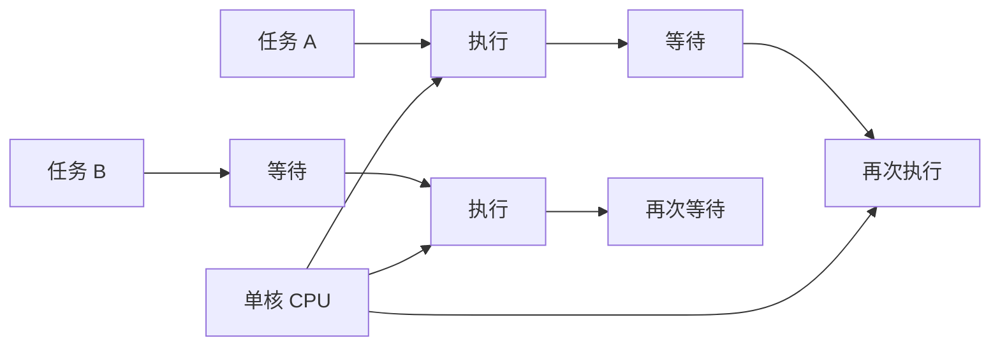

---

## 1.2 并行

**并行（Parallelism）**指多个任务在同一个物理时刻真正同时运行。

并行通常需要多个 CPU 核心或多个处理器。

例如一个四核 CPU：

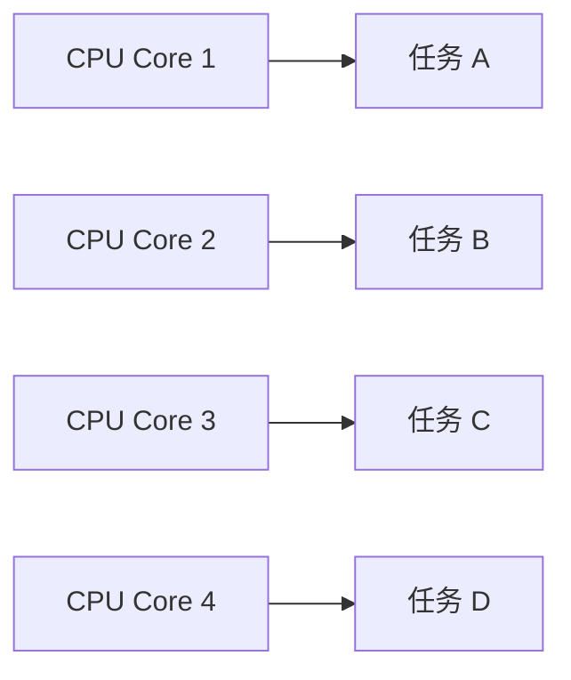

此时多个核心可以在同一时刻分别执行不同任务。

因此：

> **并行强调的是多个任务在同一个物理时刻真正同时执行。**

---

## 1.3 并发与并行的区别

| 比较维度 | 并发 Concurrency | 并行 Parallelism |
|---|---|---|
| 时间特性 | 同一时间段内交替推进 | 同一物理时刻同时执行 |
| 单核 CPU | 可以实现 | 无法真正同时执行多个任务 |
| 多核 CPU | 可以实现 | 可以实现 |
| 核心思想 | 多个任务都能得到推进 | 多个任务同时执行 |
| 常见场景 | I/O 等待、网络服务 | 多核计算、图像处理 |

可以简单理解为：

> **并发解决“一个人如何同时处理多件事”的问题；并行解决“多个人如何同时处理多件事”的问题。**

---

# 二、I/O 密集型与 CPU 密集型

## 2.1 I/O 密集型

**I/O 密集型（I/O Bound）**程序在运行过程中，大量时间消耗在输入输出操作上，而不是 CPU 计算上。

常见 I/O：

- 磁盘读写
- 网络通信
- 数据库查询
- 文件传输
- Web 请求

特点：

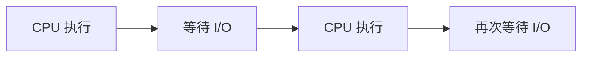

CPU 经常处于等待状态。

### 单核 CPU

当线程 A 等待 I/O 时，操作系统可以切换到线程 B：

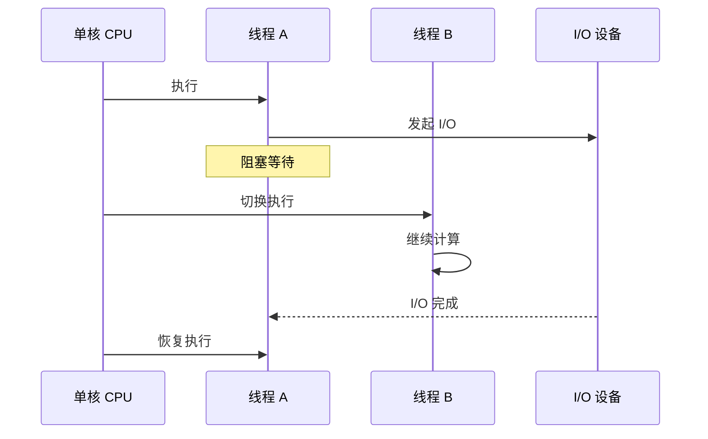

因此，多线程能够减少 CPU 因等待 I/O 而产生的空闲时间。

### 多核 CPU

多核环境下，可以同时运行更多线程。

但对于 I/O 密集型任务，真正的瓶颈往往不是 CPU，而是：

- 磁盘速度
- 网络延迟
- 数据库响应速度
- 外部服务响应速度

因此，I/O 密集型任务的线程数通常可以高于 CPU 核心数。

---

## 2.2 CPU 密集型

**CPU 密集型（CPU Bound）**程序的大部分时间都消耗在 CPU 计算上。

常见例子：

- 大数计算
- 图像处理
- 视频编解码
- 复杂算法
- 游戏物理计算

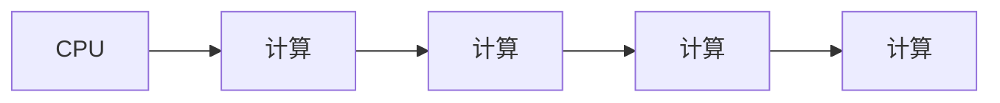

CPU 密集型任务的特点是：

- CPU 利用率高
- I/O 等待时间少
- 任务主要受 CPU 计算能力限制

### 单核 CPU

多个线程只能通过时间片进行切换：

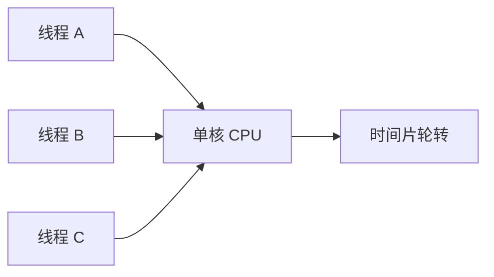

如果线程数量过多，会产生大量上下文切换开销。

### 多核 CPU

多个核心可以同时处理多个计算任务：

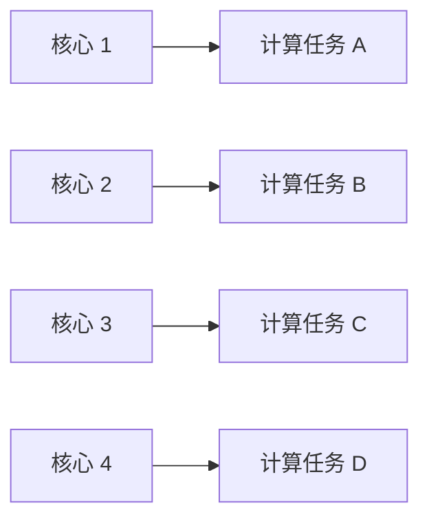

因此 CPU 密集型任务通常更关注 CPU 核心数量以及线程数量之间的关系。

---

## 2.3 两类任务与线程数量

| 任务类型 | 主要等待对象 | CPU 利用率 | 线程数量特点 |
|---|---|---:|---|
| I/O 密集型 | 网络、磁盘、数据库等 I/O | 相对较低 | 通常可以多于 CPU 核心数 |
| CPU 密集型 | CPU 计算 | 很高 | 通常接近 CPU 核心数 |

这里的线程数量并不是绝对固定值，实际还需要考虑任务本身、线程栈大小、上下文切换以及系统资源等因素。

---

# 三、线程数量

线程并不是可以无限创建的。

原始笔记中总结了四个主要原因：

1. 线程创建和销毁存在开销
2. 每个线程需要线程栈
3. 线程上下文切换存在开销
4. 大量线程同时唤醒可能造成瞬时负载升高

---

## 3.1 为什么不能无限创建线程

### 1. 创建和销毁存在开销

创建线程需要操作系统为其准备相关资源。

线程结束后，这些资源还需要回收。

如果程序不断：

```text
创建线程
    ↓
执行任务
    ↓
销毁线程
    ↓
再次创建线程
```

会产生额外开销。

线程池的核心思想之一就是：

> **线程可以重复使用，而不是每个任务都重新创建线程。**

---

### 2. 每个线程都需要线程栈

每个线程都有自己的线程栈。

创建大量线程意味着需要同时维护大量线程栈空间。

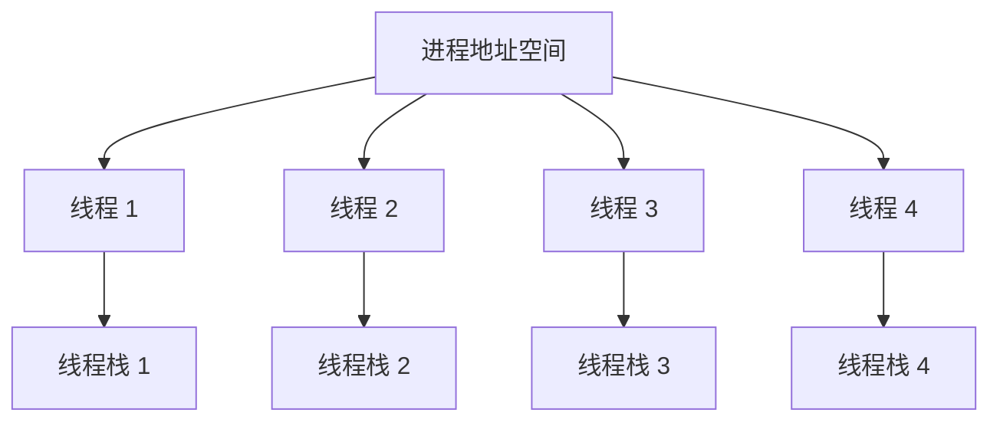

因此：

> **线程数量增加，不只是增加 CPU 调度压力，也会增加内存压力。**

---

### 3. 上下文切换

线程数量过多时，操作系统需要频繁在不同线程之间切换。

上下文切换需要保存当前线程的执行状态，并恢复另一个线程的执行状态。

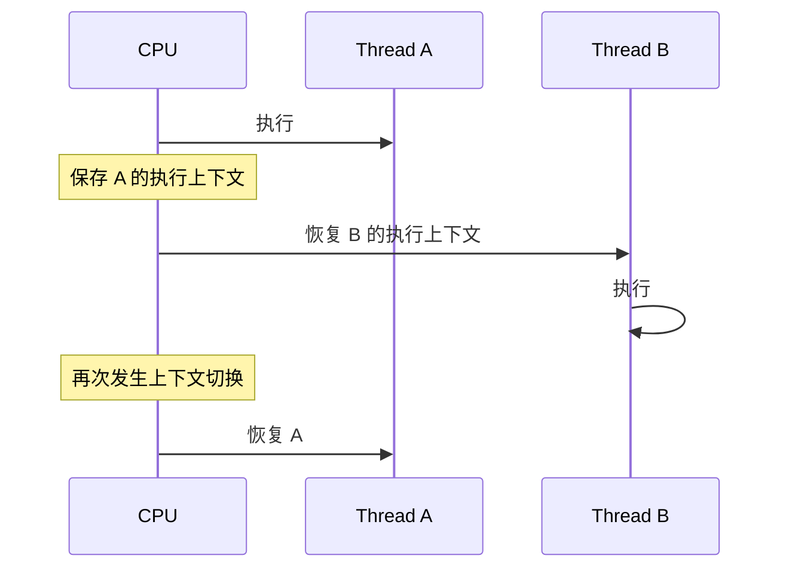

线程过多时，CPU 可能花费大量时间进行调度，而不是执行真正的业务代码。

---

### 4. 大量线程同时唤醒

如果大量线程同时从阻塞状态恢复，会产生瞬时的 CPU 调度压力。

例如：


因此线程数量需要受到合理控制。

---

## 3.2 线程栈

**线程栈（Thread Stack）**是操作系统为每个线程分配的一块独立内存区域。

主要用于保存线程执行过程中的：

- 局部变量
- 函数参数
- 函数调用关系
- 返回地址
- 部分寄存器保存信息等

### 线程栈与堆

线程栈和堆最大的区别之一是：

> **每个线程都有自己的栈，但同一个进程中的线程通常共享堆。**

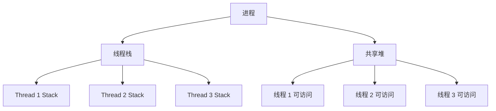

因此：

- 栈上的局部变量通常具有线程独立性
- 堆上的共享数据可能被多个线程同时访问
- 多线程访问共享数据时，需要考虑同步问题

---

## 3.3 栈溢出

如果线程栈空间被耗尽，就可能发生 **Stack Overflow（栈溢出）**。

常见原因：

### 递归层次过深

```cpp
void func()
{
    func();
}
```

函数不断递归调用，每次调用都需要新的栈帧。

### 局部变量过大

```cpp
void func()
{
    char buffer[1024 * 1024];
}
```

如果线程栈空间有限，而局部变量占用过大，也可能造成栈空间不足。

---

# 四、线程池

## 4.1 为什么需要线程池

如果每来一个任务就创建一个线程：


当任务量很大时，会产生大量线程创建、销毁和调度开销。

线程池的思路是：

> **提前创建一批线程，让这些线程反复执行任务。**


任务执行完成后，线程不会立即销毁，而是重新回到线程池等待下一个任务。

---

## 4.2 线程池基本结构

结合本次图片，可以把 ThreadPool 的核心结构抽象成：

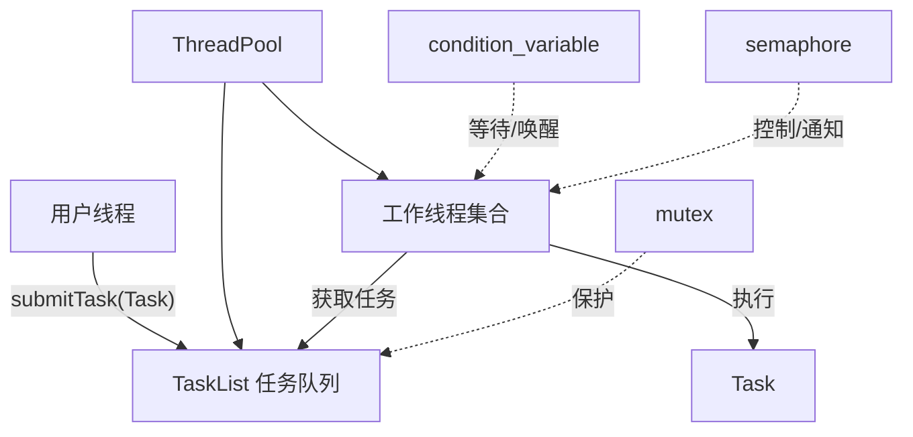

其中：

| 组成部分 | 作用 |
|---|---|
| ThreadPool | 管理整个线程池 |
| Worker Thread | 执行任务 |
| Task | 用户提交的具体任务 |
| TaskList | 保存等待执行的任务 |
| mutex | 保护共享数据 |
| condition_variable | 让线程等待任务，并在任务到达后唤醒 |
| semaphore | 通过计数方式进行线程同步/资源同步 |

---

## 4.3 Fixed 模式

**Fixed 模式**下，线程池中的线程数量固定。

创建线程池时确定线程数量，运行过程中一般不会因为任务数量变化而不断创建新线程。

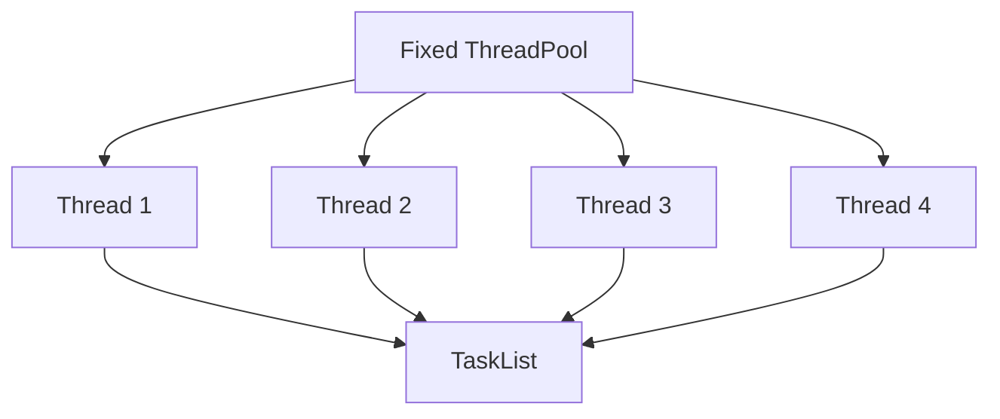

例如：

```cpp
ThreadPool pool;

pool.setMode(ThreadPool::fixed);
pool.start();
```

Fixed 模式适合线程数量相对稳定、希望控制线程资源的场景。

---

## 4.4 Cached 模式

**Cached 模式**下，线程数量可以根据任务量动态变化。

当任务数量增加、已有线程不足时，可以创建更多线程。

当动态创建的线程长时间空闲时，可以回收这些线程，使线程池回到较小的规模。

原笔记中的典型描述是：

> 动态增长的线程空闲一段时间后，如果没有继续处理任务，则关闭这些线程，保持池中的初始线程数量。


图片中的结构可以理解为：

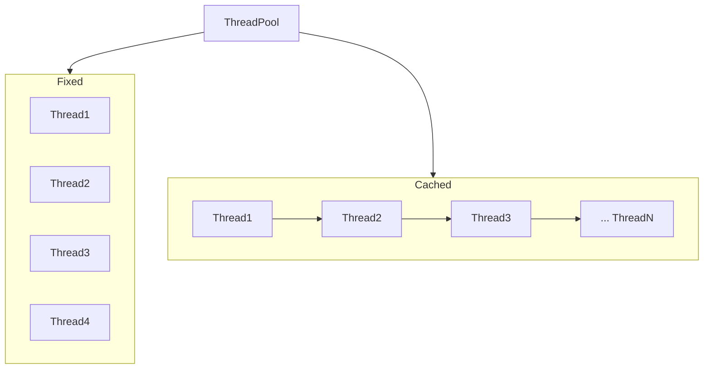

Cached 模式的核心特点：

> **线程数量随着任务压力动态调整，而不是始终固定。**

---

## 4.5 两种模式对比

| 特性 | Fixed | Cached |
|---|---|---|
| 线程数量 | 固定 | 动态变化 |
| 创建线程时机 | 启动线程池时 | 任务压力增加时 |
| 线程回收 | 通常不因空闲自动回收 | 空闲超时后可回收 |
| 资源可控性 | 较强 | 更灵活 |
| 适合场景 | 负载较稳定 | 任务量波动较大 |

---

# 五、线程同步

多个线程共同访问共享资源时，需要考虑线程同步问题。

ThreadPool 中尤其需要保护：

- 任务队列
- 线程池状态
- 任务数量
- 线程数量等共享状态

常见同步方式包括：

- `mutex`
- `atomic`
- `condition_variable`
- `semaphore`
- CAS

---

## 5.1 线程互斥

### mutex

互斥锁的核心思想：

> **同一时刻只允许一个线程进入受保护的临界区。**

```cpp
std::mutex mtx;

mtx.lock();

// 临界区

mtx.unlock();
```

更常见的是使用 RAII：

```cpp
std::lock_guard<std::mutex> lock(mtx);

// 临界区
```

### 临界区

临界区是访问共享资源的代码区域。


---

## 5.2 竞态条件

**竞态条件（Race Condition）**是指：

> 多个线程执行过程中，最终结果依赖于线程之间的执行先后顺序。

例如：

```cpp
counter++;
```

看起来只有一行，但本质上通常包含：

```text
读取 counter
    ↓
执行加法
    ↓
写回 counter
```

如果两个线程同时操作，就可能出现错误结果。

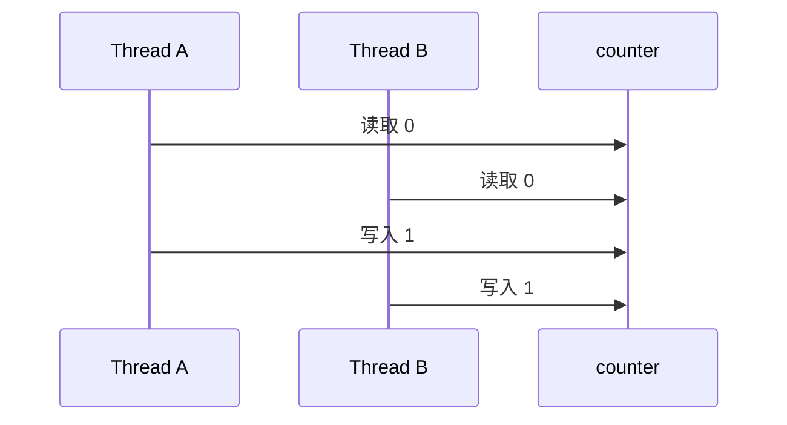

最终可能得到 `1`，而不是预期的 `2`。

---

## 5.3 数据竞争与竞态条件

两者容易混淆。

| 比较维度 | Data Race 数据竞争 | Race Condition 竞态条件 |
|---|---|---|
| 核心 | 多线程无同步地访问同一内存位置，其中至少一次是写 | 程序结果依赖执行时序 |
| 关注点 | 内存访问安全 | 业务逻辑正确性 |
| C++ 标准 | 数据竞争会导致 Undefined Behavior | 不一定产生 Undefined Behavior |
| 是否一定需要共享内存 | 是 | 不一定 |
| 加锁是否解决 | 正确同步通常可消除数据竞争 | 不一定，业务逻辑仍可能存在时序问题 |

一个重要关系是：

> **数据竞争更偏向内存访问层面；竞态条件更偏向程序逻辑和执行时序层面。**

---

## 5.4 可重入函数

**可重入函数（Reentrant Function）**是指函数在执行过程中，即使被再次调用，也不会因为共享状态导致数据破坏或逻辑错误。

典型特征：

- 尽量只使用局部变量
- 不依赖共享的可修改全局状态
- 不依赖危险的静态状态
- 使用参数和局部数据完成操作

例如：

```cpp
int add(int a, int b)
{
    int result = a + b;
    return result;
}
```

多个线程同时调用时，每个线程拥有自己的参数和局部变量。

---

## 5.5 不可重入函数

如果一个函数依赖共享的可修改状态，函数被再次进入时可能导致数据破坏或逻辑错误，就可能属于不可重入场景。

常见风险来源：

- 全局可修改变量
- 静态可修改变量
- 返回指向共享静态数据的指针
- 使用非线程安全的共享状态

需要注意：

> **“使用 malloc/free 就一定不可重入”不能简单作为绝对结论。**

具体是否可重入、是否线程安全，需要结合具体实现、调用方式以及平台环境判断。

---

## 5.6 CAS

**CAS（Compare-And-Swap）**是一种常见的原子操作思想，也是许多无锁数据结构的基础。

CAS 通常包含三个概念：

- `V`：需要修改的内存位置
- `A`：预期值
- `B`：新值

逻辑：

```text
如果 V == A
    V = B
否则
    不修改
```

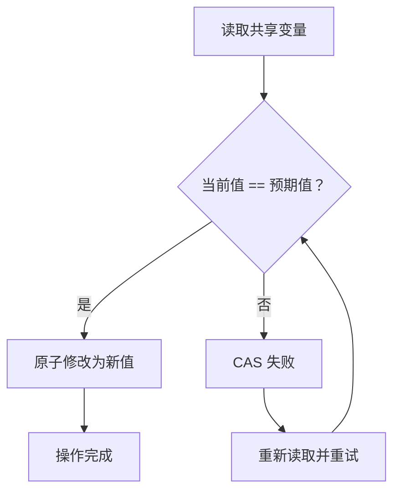

例如：

```text
当前值：10
预期值：10
新值：20

10 == 10
    ↓
修改
    ↓
20
```

如果其他线程已经将值修改为 `30`：

```text
当前值：30
预期值：10

30 != 10
    ↓
CAS 失败
    ↓
不会覆盖其他线程的修改
```

### CAS 优点

- 不需要传统互斥锁阻塞线程
- 适合低竞争场景
- CPU 通常通过原子指令提供支持

### CAS 缺点

- 高竞争时不断重试会消耗 CPU
- 存在 ABA 问题
- 普通 CAS 通常针对一个原子值，复杂的多变量一致性仍然需要其他机制

---

## 5.7 ABA 问题

假设线程 A 读取到：

```text
A
```

此时线程 B 修改：

```text
A → B → A
```

线程 A 再次进行 CAS 时发现：

```text
当前值 == A
```

于是认为值从未发生变化。

但实际上中间已经经历过一次修改。

```mermaid
sequenceDiagram
    participant A as Thread A
    participant X as Shared Value
    participant B as Thread B

    A->>X: 读取 A
    B->>X: A → B
    B->>X: B → A
    A->>X: CAS：A → C
    Note over A,X: CAS 只看到当前仍然是 A
```

一种常见解决方式是：

> **值 + 版本号**

例如：

```text
(A, version=1)
        ↓
(B, version=2)
        ↓
(A, version=3)
```

即使值重新变成 `A`，版本号已经发生变化。

---

# 六、线程通信

线程同步解决的是“多个线程如何安全协作”。

线程通信解决的是：

> **一个线程如何通知另一个线程：某件事情已经发生，可以继续执行了。**

ThreadPool 中最典型的场景就是：

```text
用户线程提交任务
        ↓
任务进入任务队列
        ↓
工作线程原本处于等待状态
        ↓
通知工作线程
        ↓
工作线程获取任务
        ↓
执行任务
```

---

## 6.1 condition_variable

C++ 中常使用：

```cpp
std::condition_variable
```

配合：

```cpp
std::mutex
std::unique_lock
```

实现线程等待和唤醒。

典型结构：

```cpp
std::unique_lock<std::mutex> lock(mtx);

while (condition_not_ready)
{
    cond.wait(lock);
}
```

当条件满足后：

```cpp
cond.notify_one();
```

或者：

```cpp
cond.notify_all();
```

### wait 做了什么

`condition_variable::wait()` 的核心过程可以理解为：

```mermaid
sequenceDiagram
    participant T as 工作线程
    participant M as mutex
    participant C as condition_variable

    T->>M: 获取锁
    T->>C: wait(lock)
    Note over T: 释放 mutex
    Note over T: 进入等待状态

    C-->>T: notify
    Note over T: 重新竞争 mutex
    T->>M: 获取锁
    T->>T: 检查条件
```

因此 `wait()` 并不是简单地“睡眠”。

它的重要特点是：

> **等待时释放 mutex；被唤醒后重新竞争 mutex，拿到锁后继续执行。**

### 为什么通常使用 while

推荐：

```cpp
while (queue.empty())
{
    cond.wait(lock);
}
```

而不是只写：

```cpp
if (queue.empty())
{
    cond.wait(lock);
}
```

因为线程被唤醒后仍然需要再次检查共享条件是否真的满足。

---

## 6.2 生产者-消费者模型

ThreadPool 中的任务队列可以看成经典的：

> **生产者-消费者模型**

### 生产者

用户线程负责提交任务：

```text
submitTask()
    ↓
生产 Task
    ↓
TaskList
```

### 消费者

工作线程负责从任务队列取任务：

```text
TaskList
    ↓
Worker Thread
    ↓
执行 Task
```

整体关系：

```mermaid
flowchart LR
    P["生产者<br/>用户线程"] -->|"提交 Task"| Q["TaskList<br/>任务队列"]
    Q -->|"获取 Task"| C1["Worker 1"]
    Q -->|"获取 Task"| C2["Worker 2"]
    Q -->|"获取 Task"| C3["Worker N"]

    C1 --> E["执行任务"]
    C2 --> E
    C3 --> E
```

### 典型同步过程

#### 生产者

```cpp
std::unique_lock<std::mutex> lock(mtx);

// 添加任务
taskQueue.push(task);

// 通知消费者
cond.notify_one();
```

#### 消费者

```cpp
std::unique_lock<std::mutex> lock(mtx);

while (taskQueue.empty())
{
    cond.wait(lock);
}

// 获取任务
auto task = taskQueue.front();
taskQueue.pop();
```

---

## 6.3 semaphore

**信号量（Semaphore）**可以理解为一个带计数的同步工具。

与只能表示“有锁/没锁”的 mutex 相比，信号量可以维护一个更一般的资源计数。

例如：

```cpp
std::counting_semaphore<1024> sem(0);
```

初始计数为 `0`。

生产者：

```cpp
sem.release();
```

表示资源数量增加。

消费者：

```cpp
sem.acquire();
```

表示尝试获取一个资源。

如果当前计数为 `0`，线程需要等待。

```mermaid
flowchart LR
    P["生产者"] -->|"生产一个任务"| R["release()"]
    R --> S["Semaphore Counter + 1"]
    S --> A["消费者 acquire()"]
    A --> C["获取资源并执行"]
```

---

## 6.4 mutex 与 semaphore 的区别

| 对比 | mutex | semaphore |
|---|---|---|
| 核心概念 | 互斥访问 | 资源计数 |
| 计数 | 通常可理解为 0/1 | 可以表示多个资源 |
| 主要用途 | 保护临界区 | 同步、资源数量控制 |
| 获取/释放关系 | 通常由持有锁的线程解锁 | `acquire/release` 可以由不同线程参与 |
| 典型场景 | 保护任务队列 | 任务数量、资源数量、线程同步 |

可以将二元信号量理解为一种只有 `0/1` 两种状态的信号量，但它与 `mutex` 在所有语义和使用约束上并不完全等价。

---

## 6.5 PV 操作

经典信号量中：

- **P 操作**：等待资源
- **V 操作**：释放/增加资源

在现代 C++ 中可以对应理解为：

```text
P → wait / acquire
V → post / release
```

例如：

```cpp
sem.acquire();   // P
// 使用资源
sem.release();   // V
```

---

# 七、静态库与动态库

## 7.1 什么是库

库可以理解为：

> **已经编译好的、可以被程序复用的代码集合。**

程序开发过程中，可以把一些通用功能封装成库，让其他程序链接或加载使用。

常见形式：

| 类型 | Linux | Windows |
|---|---|---|
| 静态库 | `.a` | `.lib` |
| 动态库 | `.so` | `.dll` |

---

## 7.2 静态库

静态库会在链接阶段被链接到最终程序中。

```mermaid
flowchart LR
    C["源代码"] --> O["目标文件 .o"]
    O --> L["链接"]
    SA["静态库 .a"] --> L
    L --> EXE["可执行文件"]
```

例如：

```text
main.o
ThreadPool.o
    +
libxxx.a
    ↓
可执行文件
```

### 静态库特点

- 链接发生在构建阶段
- 程序运行时通常不再依赖对应的静态库文件
- 部署比较直接
- 多个程序分别链接同一份库代码时，各自的可执行文件可能包含自己的库代码副本

因此静态链接可能带来：

> **可执行文件体积增大、代码重复等问题。**

---

## 7.3 动态库

动态库不会像静态库一样把所有相关代码直接复制到最终可执行文件中。

程序运行过程中，可以由动态链接器加载共享库。

```mermaid
flowchart LR
    C["源代码"] --> O["目标文件 .o"]
    O --> L["链接"]
    SO["动态库 .so"] --> L
    L --> EXE["可执行文件"]

    EXE --> RUN["运行"]
    RUN --> LOADER["动态加载/链接"]
    LOADER --> SO
```

动态库的一个重要特点是：

> **多个进程可以共享同一份动态库中的代码映射，从而减少重复占用。**

动态库还便于对库进行独立升级。

---

## 7.4 静态库与动态库对比

| 特性 | 静态库 | 动态库 |
|---|---|---|
| 常见后缀 | `.a` / `.lib` | `.so` / `.dll` |
| 主要链接时机 | 构建时 | 运行时加载/动态链接 |
| 可执行文件 | 通常更大 | 通常更小 |
| 运行时依赖库文件 | 通常不需要对应静态库 | 通常需要对应动态库 |
| 共享代码 | 较弱 | 较强 |
| 升级库 | 通常需要重新链接程序 | 可以独立替换兼容版本的库 |

---

# 八、ThreadPool 对外使用方式

结合图片中的调用关系，一个使用 ThreadPool 的程序可以抽象为：

```mermaid
sequenceDiagram
    participant User as 用户程序
    participant Pool as ThreadPool
    participant Queue as TaskList
    participant Worker as Worker Thread
    participant Result as Result

    User->>Pool: 创建 ThreadPool
    User->>Pool: setMode(fixed/cached)
    User->>Pool: start()

    User->>Pool: submitTask(concreteTask)
    Pool->>Queue: 加入 Task
    Pool->>Worker: 通知

    Worker->>Queue: 获取 Task
    Worker->>Worker: 执行 Task
    Worker->>Result: 保存执行结果

    User->>Result: result.get()
    Result-->>User: 获取异步结果
```

---

## 8.1 创建线程池

```cpp
ThreadPool pool;
```

此时创建线程池对象。

---

## 8.2 设置线程池模式

图片中使用：

```cpp
pool.setMode(fixed);
```

或者：

```cpp
pool.setMode(cached);
```

其中：

- `fixed`：固定线程数量
- `cached`：线程数量动态变化

默认模式可以设置为 `fixed`。

---

## 8.3 启动线程池

```cpp
pool.start();
```

启动线程池后，线程池可以创建并运行工作线程。

工作线程启动后通常会：

```mermaid
flowchart TD
    Start["Worker Thread 启动"] --> Lock["获取 mutex"]
    Lock --> Check{"任务队列为空？"}
    Check -->|"是"| Wait["condition_variable 等待"]
    Wait --> Wake["被任务提交唤醒"]
    Wake --> Lock
    Check -->|"否"| Get["获取 Task"]
    Get --> Unlock["释放/退出临界区"]
    Unlock --> Execute["执行 Task"]
    Execute --> Lock
```

---

## 8.4 提交异步任务

用户程序提交：

```cpp
Result result = pool.submitTask(concreteTask);
```

此时 `submitTask()` 的核心意义是：

> **把任务提交给线程池，而不是让当前用户线程直接执行任务。**

可以抽象成：

```mermaid
flowchart LR
    U["用户线程"] --> S["submitTask()"]
    S --> T["Task"]
    T --> Q["TaskList"]
    Q --> W["Worker Thread"]
    W --> E["执行"]
```

任务执行完成后，对应结果会被保存下来。

---

## 8.5 获取异步结果

```cpp
result.get().Cast<结果类型>()
```

这里体现的是：

> **任务提交与任务结果获取可以分离。**

用户线程先提交任务：

```cpp
Result result = pool.submitTask(concreteTask);
```

之后再获取结果：

```cpp
result.get();
```

整体可以理解为：

```mermaid
flowchart LR
    Submit["submitTask()"] --> Result["Result"]
    Result --> Wait["等待任务完成"]
    Wait --> Get["result.get()"]
    Get --> Cast["Cast<结果类型>()"]
    Cast --> Value["最终结果"]
```

---

# 九、ThreadPool 整体结构

结合本次图片，可以将 ThreadPool 的整体关系归纳为以下结构。

```mermaid
flowchart TB
    User["用户程序"]

    Pool["ThreadPool"]

    Mode{"线程池模式"}

    Fixed["Fixed<br/>固定线程数量"]
    Cached["Cached<br/>动态线程数量"]

    Workers["Worker Threads"]
    Queue["TaskList<br/>任务队列"]

    Mutex["mutex<br/>保护共享数据"]
    Cond["condition_variable<br/>等待 / 唤醒"]
    Sem["semaphore<br/>计数同步"]

    Task["Task"]
    Result["Result"]

    User --> Pool
    Pool --> Mode

    Mode --> Fixed
    Mode --> Cached

    Fixed --> Workers
    Cached --> Workers

    User -->|"submitTask()"| Task
    Task --> Queue

    Queue --> Workers
    Workers -->|"执行"| Task
    Task -->|"执行完成"| Result

    Mutex -.-> Queue
    Cond -.-> Workers
    Sem -.-> Workers

    Result -->|"get()"| User
```

从整体上看，ThreadPool 的核心结构可以归纳成：

> **用户提交任务 → 任务进入任务队列 → 工作线程等待/获取任务 → 执行任务 → 产生结果 → 用户获取结果**

而线程池之所以能够安全地完成这一过程，核心依赖：

```text
线程池
├── Worker Threads
├── TaskList
├── mutex
├── condition_variable
├── semaphore
└── Result
```

其中：

- **Worker Threads**：真正执行任务
- **TaskList**：暂存等待执行的任务
- **mutex**：保护共享数据
- **condition_variable**：协调线程等待与唤醒
- **semaphore**：通过计数机制进行同步
- **Result**：承载异步任务执行结果

---

## ThreadPool 核心工作流程

```mermaid
flowchart TD
    A["用户程序启动"] --> B["创建 ThreadPool"]
    B --> C["选择 fixed / cached"]
    C --> D["pool.start()"]
    D --> E["创建 / 管理 Worker Threads"]

    F["用户提交 Task"] --> G["submitTask()"]
    G --> H["TaskList"]

    H --> I{"Worker 是否有任务可执行？"}

    I -->|"没有"| J["condition_variable 等待"]
    J --> K["新任务到达"]
    K --> I

    I -->|"有"| L["Worker 获取 Task"]
    L --> M["执行 Task"]
    M --> N["保存 Result"]
    N --> O["Worker 回到任务队列继续等待"]

    P["用户调用 result.get()"] --> N
```

---

## 本次架构图对应关系

原始架构图中的主要元素可以对应为：

| 图片中的元素 | 含义 |
|---|---|
| `ThreadPool pool` | 创建线程池对象 |
| `fixed / cached` | 线程池工作模式 |
| `Thread1 ~ ThreadN` | 工作线程 |
| `Task1 ~ TaskN` | 等待执行的任务 |
| `TaskList` | 任务队列 |
| `mutex + condition_variable` | 保护任务队列并实现等待/唤醒 |
| `semaphore` | 计数式同步机制 |
| `submitTask()` | 用户向线程池提交异步任务 |
| `Result` | 异步任务结果 |
| `result.get()` | 获取任务执行结果 |
| `Cast<结果类型>()` | 将结果转换为具体类型 |

---

## 架构图

项目结构示意图原图也可以直接查看：

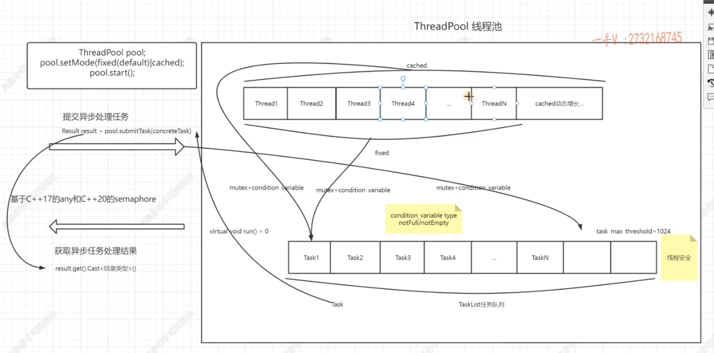

