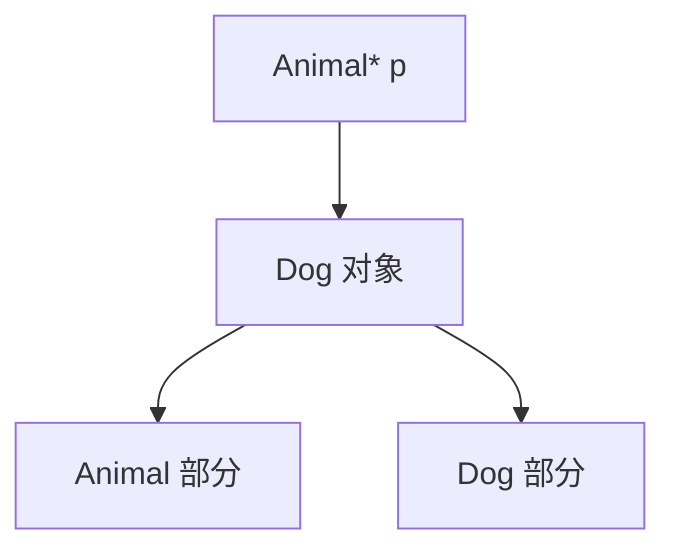
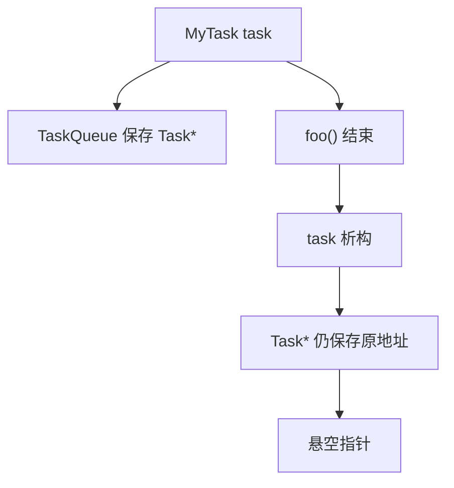
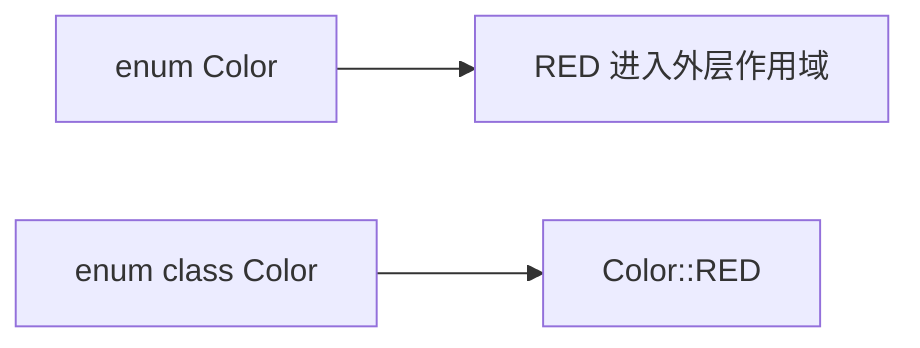
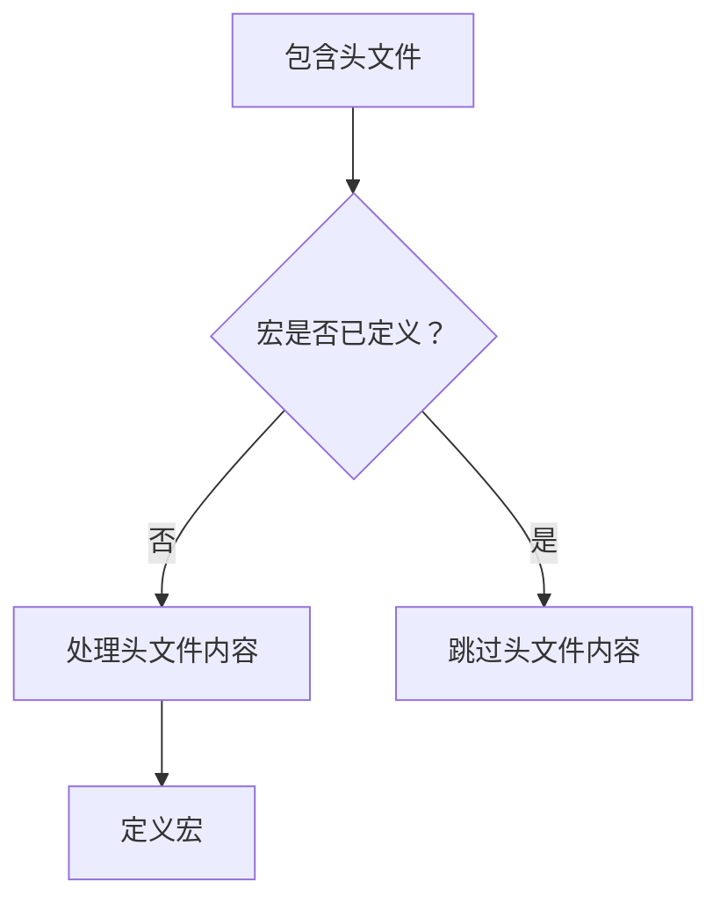
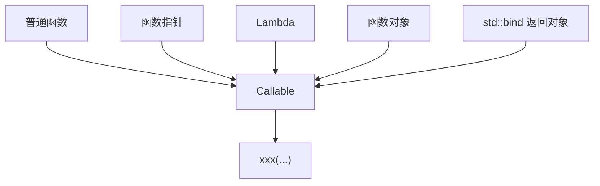
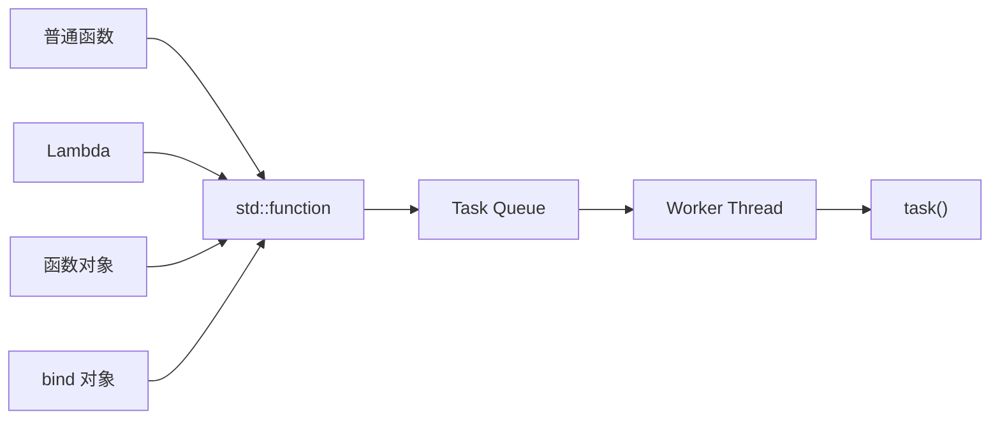
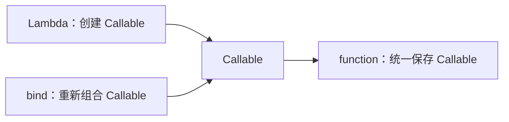
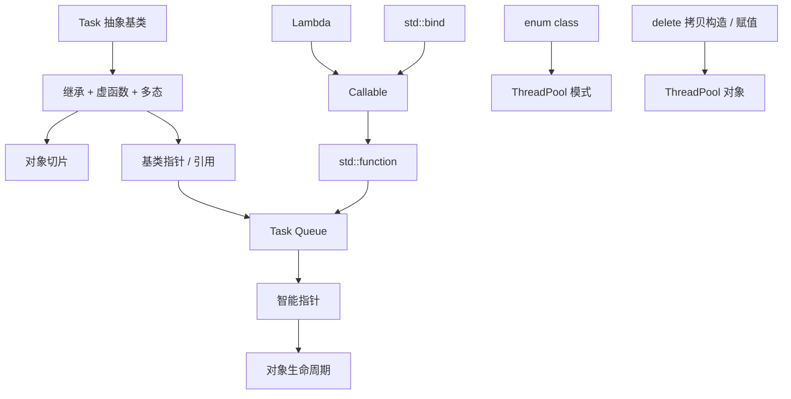

# ThreadPool 项目学习：知识点查漏补缺

> 本笔记用于补充阅读 ThreadPool 项目源码时容易遇到、但基础知识中容易遗漏的 C++ 知识点。
>
> 内容以当前项目学习所需要的知识为中心，重点覆盖：
> - C++ 多态与对象切片
> - 任务队列为什么使用智能指针
> - `enum` 与 `enum class`
> - 禁用拷贝构造与赋值
> - `const` 与 `#define`
> - Callable、Lambda、`std::function`、`std::bind`

---

## 一、C++ 多态与对象切片

<details>
<summary>点击展开查看详情</summary>

### 1.1 为什么 ThreadPool 中需要理解多态

ThreadPool 通常会把“任务”抽象成一个基类，然后让用户继承这个基类，实现自己的具体任务。

```cpp
class Task
{
public:
    virtual void run() = 0;
    virtual ~Task() = default;
};
```

用户可以定义：

```cpp
class MyTask : public Task
{
public:
    void run() override
    {
        std::cout << "MyTask run" << std::endl;
    }
};
```

此时：

```cpp
MyTask task;
Task* p = &task;
p->run();
```

虽然 `p` 的静态类型是 `Task*`，但它实际指向的是 `MyTask`。由于 `run()` 是虚函数，最终执行的是 `MyTask::run()`。


---

### 1.2 对象切片

如果：

```cpp
Dog dog;
Animal a = dog;
a.speak();
```

这里不是让 `a` 指向 `dog`，而是使用 `dog` 的基类部分构造出了一个新的 `Animal` 对象。派生类部分不会进入这个新的基类对象。

这就是 **对象切片（Object Slicing）**。


---

### 1.3 为什么基类指针可以实现多态

```cpp
Dog dog;
Animal* p = &dog;
p->speak();
```

这里没有创建新的 `Animal` 对象，`p` 只是保存 `dog` 的地址，因此仍然保留实际的 `Dog` 对象身份。



关键区别：

| 写法 | 新建基类对象 | 保留派生对象身份 |
|---|---:|---:|
| `Animal a = dog` | 是 | 否 |
| `Animal* p = &dog` | 否 | 是 |
| `Animal& ref = dog` | 否 | 是 |

---

### 1.4 基类引用与多态

```cpp
Dog dog;
Animal& ref = dog;
ref.speak();
```

`ref` 不是一个新的 `Animal` 对象，而是 `dog` 的另一个访问入口，因此仍然可以调用 `Dog::speak()`。

运行时多态通常需要：

- 基类函数声明为 `virtual`
- 通过基类指针或基类引用访问

---

</details>


## 二、任务队列为什么使用智能指针

<details>
<summary>点击展开查看详情</summary>

ThreadPool 的任务队列存在一个重要问题：**任务对象到底由谁负责管理生命周期？**

### 2.1 裸指针的问题

```cpp
void submitTask(Task* task)
{
    taskQueue.push(task);
}
```

裸指针本身只是一个地址，并不拥有对象，也不会自动负责对象的生命周期。

它不会自动：

- 延长对象生命周期
- 自动释放对象
- 表达明确的所有权关系

---

### 2.2 悬空指针

例如：

```cpp
void submitTask(Task* task)
{
    taskQueue.push(task);
}

void foo()
{
    MyTask task;
    submitTask(&task);
}
```

当 `foo()` 返回后，`task` 被析构，但队列中仍然保存原来的地址。



之后工作线程再执行：

```cpp
Task* task = taskQueue.front();
task->run();
```

就可能访问已经失效的对象。

---

### 2.3 智能指针解决什么问题

智能指针的重要作用是通过 RAII 管理对象生命周期。

例如：

```cpp
std::unique_ptr<Task> task = std::make_unique<MyTask>();
taskQueue.push(std::move(task));
```

所有权可以转移给任务队列：


核心思想：

> **谁拥有任务对象，谁负责它的生命周期。**

---

### 2.4 unique_ptr 与 shared_ptr 的基本区别

| 特性 | `unique_ptr` | `shared_ptr` |
|---|---|---|
| 所有权 | 独占 | 共享 |
| 是否允许复制 | 不允许 | 允许 |
| 所有权转移 | `std::move` | 引用计数 |
| 管理成本 | 较低 | 较高 |
| 典型用途 | 明确唯一所有者 | 多个对象共同持有 |

如果任务的生命周期是“提交 → 队列持有 → Worker 执行 → 销毁”，单一所有权通常更容易设计和理解。

---

</details>

## 三、enum 与 enum class

<details>
<summary>点击展开查看详情</summary>

### 3.1 enum

传统枚举：

```cpp
enum PoolMode
{
    FIXED,
    CACHED
};
```

使用：

```cpp
PoolMode mode = FIXED;
```

传统 `enum` 的枚举项会进入外层作用域，容易发生命名冲突。

---

### 3.2 enum class

C++11 引入限域枚举：

```cpp
enum class PoolMode
{
    FIXED,
    CACHED
};
```

使用：

```cpp
PoolMode mode = PoolMode::FIXED;
```

枚举项属于 `PoolMode` 自己的作用域。

---

### 3.3 作用域区别

```cpp
enum Color
{
    RED,
    GREEN
};

Color c = RED;
```

而：

```cpp
enum class Color
{
    RED,
    GREEN
};

Color c = Color::RED;
```



---

### 3.4 类型安全区别

传统 `enum` 可以与整数发生隐式转换：

```cpp
enum Priority
{
    LOW,
    MEDIUM,
    HIGH
};

int value = LOW;
```

而 `enum class` 不允许这样隐式转换：

```cpp
enum class Priority
{
    LOW,
    MEDIUM,
    HIGH
};

// int value = Priority::LOW;  // 编译错误
int value = static_cast<int>(Priority::LOW);
```

因此 `enum class` 更有利于保持类型安全。

---

### 3.5 前置声明

C++11 中，传统 `enum` 可以通过指定底层类型进行前置声明：

```cpp
enum Status : int;
```

再定义：

```cpp
enum Status : int
{
    SUCCESS,
    FAILURE
};
```

`enum class` 可以直接前置声明：

```cpp
enum class Status;
```

再定义：

```cpp
enum class Status
{
    SUCCESS,
    FAILURE
};
```

在 ThreadPool 中，使用 `enum class` 表示线程池模式、状态等信息时，代码通常更加明确：

```cpp
pool.setMode(PoolMode::FIXED);
```

---

</details>

## 四、禁用拷贝构造与赋值操作

<details>
<summary>点击展开查看详情</summary>

### 4.1 为什么需要禁用拷贝

有些对象不应该被简单复制，例如：

- 互斥锁
- 文件句柄封装对象
- 网络连接
- 管理独占资源的对象
- `std::unique_ptr`
- 某些线程管理对象

如果两个对象错误地认为自己拥有同一个资源，就可能导致重复释放或错误管理。

---

### 4.2 delete 语法

C++11 提供 `= delete`：

```cpp
class NonCopyable
{
public:
    NonCopyable() = default;
    ~NonCopyable() = default;

    NonCopyable(const NonCopyable&) = delete;
    NonCopyable& operator=(const NonCopyable&) = delete;
};
```

分别表示：

```cpp
NonCopyable(const NonCopyable&) = delete;
```

禁用拷贝构造。

```cpp
NonCopyable& operator=(const NonCopyable&) = delete;
```

禁用拷贝赋值。

---

### 4.3 ThreadPool 中的意义

ThreadPool 内部通常拥有：

- 工作线程
- mutex
- condition_variable
- 任务队列
- 线程状态

如果允许：

```cpp
ThreadPool pool1;
ThreadPool pool2 = pool1;
```

就必须回答一个问题：**两个线程池如何管理原线程、锁和任务队列？**

因此资源管理类通常需要谨慎设计复制语义，必要时直接禁用复制。

---

</details>

## 五、const 与 #define

<details>
<summary>点击展开查看详情</summary>

### 5.1 #define

```cpp
#define MAX_LENGTH 100
```

宏主要发生在预处理阶段，可以简单理解为文本替换：

```cpp
int a = MAX_LENGTH;
```

经过预处理后近似变成：

```cpp
int a = 100;
```

它不是普通的 C++ 变量，因此没有普通对象意义上的类型检查和作用域语义。

---

### 5.2 const

```cpp
const int MAX_LENGTH = 100;
```

这里是一个具有类型的 C++ 对象，并且不能通过该名字修改其值。

`const` 遵循 C++ 的作用域和类型系统。

---

### 5.3 两者核心区别

| 对比 | `#define` | `const` |
|---|---|---|
| 本质 | 预处理宏 | C++ 对象 |
| 类型 | 无 C++ 类型 | 有类型 |
| 作用域 | 文本替换机制 | C++ 作用域 |
| 类型检查 | 无 | 有 |
| 调试 | 通常不如变量直观 | 更适合调试 |
| 定义常量 | 一般不优先 | 通常推荐 |

需要注意：不能简单地说“所有 `const` 都一定分配在数据段”。具体存储位置取决于对象类型、作用域、编译器优化以及使用方式。

---

### 5.4 头文件中的宏保护

`#define` 在头文件保护等预处理场景中仍然非常重要：

```cpp
#ifndef THREAD_POOL_H
#define THREAD_POOL_H

// header content

#endif
```

第一次包含时处理内容并定义宏；之后再次包含时，因为宏已经存在，就跳过文件内容。



---

</details>

## 六、Callable：什么是可调用对象

<details>
<summary>点击展开查看详情</summary>

如果一个对象能够使用类似：

```cpp
object(...);
```

的形式调用，就可以把它理解为可调用对象（Callable）。

### 6.1 普通函数

```cpp
void hello()
{
    std::cout << "hello\\n";
}

hello();
```

### 6.2 函数指针

```cpp
void (*func)() = hello;
func();
```

### 6.3 Lambda

```cpp
auto func = []()
{
    std::cout << "hello\\n";
};

func();
```

Lambda 还可以捕获外部变量：

```cpp
int value = 10;

auto task = [value]()
{
    std::cout << value << std::endl;
};
```

### 6.4 函数对象

函数对象（Functor）本质上是重载了 `operator()` 的对象：

```cpp
struct Hello
{
    void operator()()
    {
        std::cout << "hello\\n";
    }
};

Hello h;
h();
```

这些类型虽然完全不同，但都可以形成：

```cpp
xxx(...);
```

的调用形式。



---

</details>

## 七、std::function

<details>
<summary>点击展开查看详情</summary>

### 7.1 基本概念

头文件：

```cpp
#include <functional>
```

`std::function` 可以理解为一个通用的可调用对象包装器。

```cpp
void hello()
{
    std::cout << "hello\\n";
}

std::function<void()> func;
func = hello;
func();
```

`std::function<void()>` 表示：

```text
返回值：void
参数：无
```

---

### 7.2 function 的类型

通用形式：

```cpp
std::function<返回值(参数列表)>
```

例如：

```cpp
std::function<void()>
std::function<void(int, int)>
std::function<int(int, int)>
```

例如：

```cpp
int add(int a, int b)
{
    return a + b;
}

std::function<int(int, int)> func = add;
int result = func(10, 20);
```

---

### 7.3 为什么 ThreadPool 很适合使用 function

线程池面对的问题是：用户提交的任务可能来自完全不同的具体类型：

- 普通函数
- Lambda
- 函数对象
- `std::bind` 返回对象
- 自定义任务对象

如果为每一种类型分别设计接口，线程池会变得复杂。

使用：

```cpp
std::function<void()>
```

可以把不同类型的可调用对象统一成一个任务接口。



核心思想：

> **不同类型的 Callable → 统一任务接口 → 放入任务队列 → Worker 调用。**

---

</details>

## 八、std::bind

<details>
<summary>点击展开查看详情</summary>

### 8.1 基本作用

`std::bind` 的核心作用是：

> **把一个可调用对象和部分参数提前绑定，生成一个新的可调用对象。**

例如：

```cpp
void add(int a, int b)
{
    std::cout << a + b << '\\n';
}

auto f = std::bind(
    add,
    10,
    std::placeholders::_1
);

f(20);
```

相当于：

```cpp
add(10, 20);
```

---

### 8.2 placeholders

```cpp
std::placeholders::_1
std::placeholders::_2
```

分别表示调用新对象时传入的第一个、第二个参数。

例如：

```cpp
auto f = std::bind(
    add,
    std::placeholders::_1,
    std::placeholders::_2
);

f(10, 20);
```

关系：

```text
f(10, 20)
   ↓
_1 = 10, _2 = 20
   ↓
add(10, 20)
```

---

### 8.3 bind 与 function 的关系

两者职责不同：

| 工具 | 作用 |
|---|---|
| `std::bind` | 重新组合参数，生成新的 Callable |
| `std::function` | 保存、包装 Callable |

可以组合使用：

```cpp
auto f = std::bind(
    add,
    10,
    std::placeholders::_1
);

std::function<void(int)> func = f;
func(20);
```


---

</details>

## 九、Lambda、bind、function 的关系

<details>
<summary>点击展开查看详情</summary>

三者职责不同：

| 工具 | 核心作用 |
|---|---|
| Lambda | 直接创建一个可调用对象 |
| `std::bind` | 把已有函数和参数重新组合，生成新的可调用对象 |
| `std::function` | 保存、包装不同类型的可调用对象 |

可以记成：



---

</details>

## 十、这些知识点在 ThreadPool 中形成的整体关系



### 从 ThreadPool 角度理解

1. **任务抽象**：`Task` 通过虚函数定义统一任务接口。
2. **多态调用**：Worker 通过基类指针/引用操作不同的具体任务，避免对象切片。
3. **生命周期管理**：任务进入队列后需要保持有效生命周期，智能指针可以表达所有权。
4. **线程池模式**：`enum class` 可以安全地表示 `FIXED`、`CACHED` 等模式。
5. **资源管理**：ThreadPool 内部拥有线程、锁和任务队列，因此需要谨慎设计复制语义。
6. **任务抽象**：Lambda、普通函数、函数对象、`bind` 对象等都可以作为 Callable，再由 `std::function` 统一包装。

---

## 核心知识关系速览

| 知识点 | 在 ThreadPool 学习中的作用 |
|---|---|
| 虚函数 | 实现任务的运行时多态 |
| 基类指针 / 引用 | 让线程池统一操作不同具体任务 |
| 对象切片 | 理解为什么不能简单按值保存派生任务 |
| 智能指针 | 管理任务对象生命周期 |
| `enum class` | 表示线程池模式、状态等枚举 |
| `= delete` | 控制资源管理对象的复制行为 |
| `const` | 定义类型安全的常量 |
| `#define` | 主要用于预处理和头文件保护等场景 |
| Callable | 理解什么对象可以作为任务执行 |
| Lambda | 快速创建任务 |
| `std::bind` | 绑定参数，生成新的 Callable |
| `std::function` | 统一保存不同类型的 Callable |
