# CThreadPool 线程池
 
> 主要学习目标：理解线程池的组成、任务队列、Worker、Manager，以及线程池动态扩缩容的整体工作过程。

---

## 1. 项目结构

当前项目主要由以下文件组成：

```text
ThreadPool/
├── .gitignore
├── CThreadPool.c
├── CThreadPool.h
└── main.c
```

| 文件 | 作用 |
|---|---|
| `CThreadPool.h` | 对外提供线程池接口 |
| `CThreadPool.c` | 线程池核心实现 |
| `main.c` | 创建线程池并提交测试任务 |

---

## 2. 整体结构

线程池可以理解成三个主要角色：

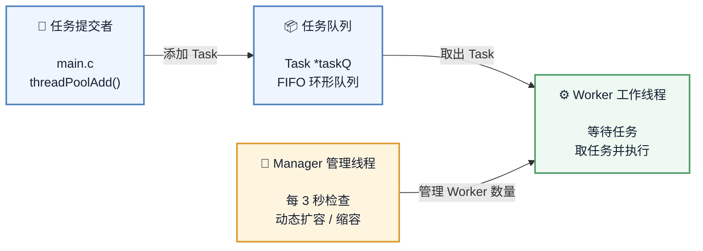

可以先记住：

> **main 负责生产任务，taskQ 负责保存任务，worker 负责执行任务，manager 负责管理 worker。**

---

# 3. `CThreadPool.h`

头文件只负责暴露线程池需要给外部使用的接口。

核心声明：

```c
typedef struct ThreadPool ThreadPool;

ThreadPool* threadPoolCreate(int min, int max, int queueSize);

int threadPoolDestroy(ThreadPool* pool);

void threadPoolAdd(ThreadPool* pool,
                   void(*func)(void*),
                   void* arg);

int threadPoolBusyNum(ThreadPool* pool);

int threadPoolAliveNum(ThreadPool* pool);
```

这里采用：

```c
typedef struct ThreadPool ThreadPool;
```

因此 `main.c` 不需要知道 `ThreadPool` 内部具体有哪些成员。

也就是说：

```text
main.c
   │
   │ 只知道
   ▼
ThreadPool *
   │
   │ 不直接访问内部成员
   ▼
CThreadPool.c
   │
   └── 真正定义 struct ThreadPool
```

这种方式可以把线程池内部实现隐藏起来。

---

# 4. `Task` 任务结构体

`CThreadPool.c` 中定义：

```c
typedef struct Task
{
    void (*function)(void *arg);
    void *arg;
} Task;
```

一个任务实际上由两部分组成：

| 成员 | 含义 |
|---|---|
| `function` | 真正要执行的函数 |
| `arg` | 传给函数的参数 |

例如 `main.c`：

```c
threadPoolAdd(pool, taskFunc, num);
```

最终形成一个类似：

```text
┌──────────────────────────────┐
│            Task              │
├──────────────────────────────┤
│ function → taskFunc()        │
│ arg      → num               │
└──────────────────────────────┘
```

Worker 取出任务后：

```c
task.function(task.arg);
```

也就是：

```text
Task
 │
 ├── function ──→ taskFunc()
 │
 └── arg ───────→ num
```

---

# 5. 线程池内部结构

`ThreadPool` 中最重要的成员可以分成四组。

## 5.1 任务队列

```c
Task *taskQ;
int queueCapacity;
int queueSize;
int queueFront;
int queueRear;
```

这是一个**环形队列**。

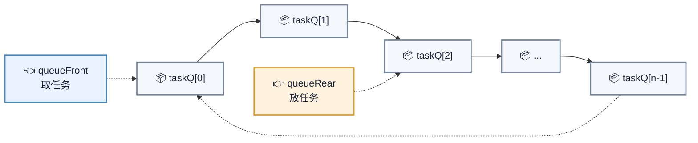

添加任务：

```c
queueRear = (queueRear + 1) % queueCapacity;
queueSize++;
```

取任务：

```c
queueFront = (queueFront + 1) % queueCapacity;
queueSize--;
```

所以它不是简单地一直向后移动，而是到达数组末尾后重新回到 `0`。

---

## 5.2 线程数量

```c
int minNum;
int maxNum;
int busyNum;
int liveNum;
int exitNum;
```

可以这样理解：

| 变量 | 含义 |
|---|---|
| `minNum` | 最少保留多少 Worker |
| `maxNum` | 最多允许多少 Worker |
| `busyNum` | 当前正在执行任务的 Worker 数量 |
| `liveNum` | 当前存活 Worker 数量 |
| `exitNum` | Manager 要求退出的 Worker 数量 |

例如：

```text
minNum = 3
maxNum = 10
liveNum = 6
busyNum = 2
```

表示：

> 当前有 6 个 Worker，其中 2 个正在工作，其他 Worker 可能处于等待状态。

---

## 5.3 同步机制

线程池使用：

```c
pthread_mutex_t mutexpool;
pthread_mutex_t mutexBusy;

pthread_cond_t notFull;
pthread_cond_t notEmpty;
```

可以理解成：

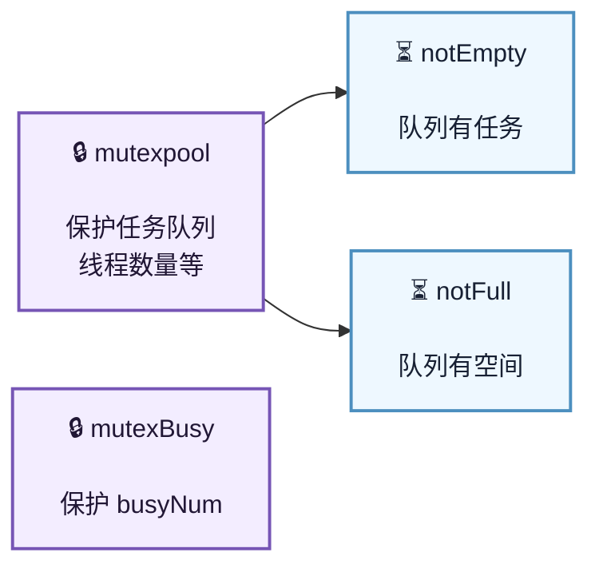

---

# 6. 创建线程池

调用：

```c
ThreadPool *pool =
    threadPoolCreate(3, 10, 100);
```

对应：

```text
min = 3
max = 10
queueSize = 100
```

也就是：

```text
最少 Worker：3
最多 Worker：10
任务队列：100
```

---

## 6.1 创建流程

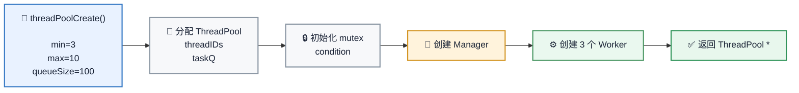

创建完成后，大致结构：

```text
ThreadPool
│
├── Manager × 1
│
├── Worker × 3
│
├── Task Queue × 100
│
├── mutex
│
└── condition variables
```

---

# 7. 添加任务

`main.c` 中：

```c
for (int i = 0; i < 100; ++i) {
    int *num = malloc(sizeof(int));
    *num = i + 100;

    threadPoolAdd(pool, taskFunc, num);
}
```

这里每次创建一个 `int`：

```text
num
 │
 └── 100 / 101 / 102 / ...
```

然后交给线程池。

---

## 7.1 `threadPoolAdd()` 的流程

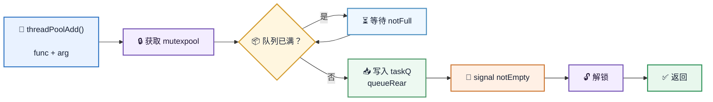

核心逻辑：

```c
while (pool->queueSize == pool->queueCapacity &&
       !pool->shutdown) {
    pthread_cond_wait(&pool->notFull,
                      &pool->mutexpool);
}
```

如果队列满了，生产者等待。

---

# 8. Worker 如何工作

Worker 是真正执行任务的线程。

核心逻辑：

```c
while (1) {
    pthread_mutex_lock(&pool->mutexpool);

    while (pool->queueSize == 0 && !pool->shutdown) {
        pthread_cond_wait(&pool->notEmpty,
                          &pool->mutexpool);
    }

    ...
}
```

因此 Worker 平时并不是一直执行任务。

没有任务时：

```text
Worker
  ↓
queueSize == 0
  ↓
pthread_cond_wait()
  ↓
睡眠
```

有任务时：

```text
threadPoolAdd()
  ↓
添加 Task
  ↓
signal(notEmpty)
  ↓
Worker 被唤醒
```

---

## 8.1 Worker 执行任务

```mermaid
flowchart LR
    A["😴 Worker<br/>等待任务"]:::sleep
    B["🔔 notEmpty<br/>被唤醒"]:::signal
    C["📦 从 taskQ<br/>取出 Task"]:::queue
    D["📊 busyNum++"]:::count
    E["⚙️ task.function<br/>(task.arg)"]:::work
    F["🗑️ free(task.arg)"]:::free
    G["📊 busyNum--"]:::count
    H["🔄 继续等待"]:::sleep

    A --> B --> C --> D --> E --> F --> G --> H --> A

    classDef sleep fill:#edf3f8,stroke:#718596,stroke-width:2px,color:#172033;
    classDef signal fill:#fff1df,stroke:#d28d28,stroke-width:2px,color:#172033;
    classDef queue fill:#eef5ff,stroke:#4d80bd,stroke-width:2px,color:#172033;
    classDef count fill:#f3edff,stroke:#7957b8,stroke-width:2px,color:#211735;
    classDef work fill:#eaf8ef,stroke:#4b9966,stroke-width:2px,color:#172033;
    classDef free fill:#fff0ed,stroke:#c96a58,stroke-width:2px,color:#172033;
```

当前源码中，任务执行结束后：

```c
free(task.arg);
```

因此当前 `threadPoolAdd()` 的使用方式默认要求 `arg` 指向可由 `free()` 释放的动态内存。

你的 `main.c` 正好使用：

```c
int *num = malloc(sizeof(int));
```

所以二者是匹配的。

---

# 9. Manager 的作用

Manager 不执行任务。

它主要负责：

> **观察线程池当前状态，然后决定是否增加或减少 Worker。**

源码中：

```c
sleep(3);
```

因此 Manager 每隔约 3 秒检查一次。

它会读取：

```c
queueSize
liveNum
busyNum
```

然后进行扩容或者缩容判断。

---

# 10. 动态扩容

当前条件：

```c
if (queueSize > liveNum &&
    liveNum < pool->maxNum)
```

也就是：

```text
任务数量 > 存活线程数量
        +
存活线程 < 最大线程数量
```

满足时增加 Worker。

每次最多增加：

```c
#define NUMBER 2
```

个。

---

## 10.1 扩容流程

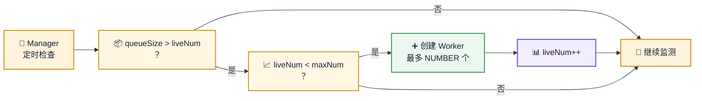

例如：

```text
queueSize = 20
liveNum   = 3
maxNum    = 10
```

满足：

```text
20 > 3
3 < 10
```

因此 Manager 可以创建新的 Worker。

---

# 11. 动态缩容

当前条件：

```c
if (busyNum * 2 < liveNum &&
    liveNum > pool->minNum)
```

可以理解成：

> 当前忙碌线程数量比较少，并且当前线程数量超过最小线程数量。

例如：

```text
busyNum = 2
liveNum = 8
minNum  = 3
```

因为：

```text
2 × 2 < 8
```

所以可以缩容。

一次最多销毁：

```text
NUMBER = 2
```

个 Worker。

---

## 11.1 缩容流程

```mermaid
flowchart LR
    A["🧠 Manager<br/>检查状态"]:::manager
    B["📊 busyNum × 2 < liveNum<br/>？"]:::decision
    C["📊 liveNum > minNum<br/>？"]:::decision
    D["📉 exitNum = 需要退出的线程数"]:::remove
    E["🔔 broadcast(notEmpty)"]:::signal
    F["😴 空闲 Worker 被唤醒"]:::worker
    G["🚪 Worker 退出"]:::exit

    A --> B
    B -->|"是"| C
    B -->|"否"| A
    C -->|"是"| D --> E --> F --> G
    C -->|"否"| A

    classDef manager fill:#fff3dc,stroke:#d39524,stroke-width:2px,color:#172033;
    classDef decision fill:#fff7e2,stroke:#d29a2b,stroke-width:2px,color:#172033;
    classDef remove fill:#fff0ed,stroke:#c96a58,stroke-width:2px,color:#172033;
    classDef signal fill:#eef5ff,stroke:#4d80bd,stroke-width:2px,color:#172033;
    classDef worker fill:#eaf8ef,stroke:#4c9967,stroke-width:2px,color:#172033;
    classDef exit fill:#f2edf8,stroke:#7957b8,stroke-width:2px,color:#211735;
```

注意：

Worker 并不是被 Manager 直接 `pthread_cancel()`。

而是：

```text
Manager
  ↓
exitNum = N
  ↓
唤醒 Worker
  ↓
Worker 自己发现需要退出
  ↓
threadExit()
```

这是一种**协作式退出**。

---

# 12. Worker 的退出判断

Worker 被唤醒后检查：

```c
if (pool->exitNum > 0 &&
    pool->queueSize == 0 &&
    pool->liveNum > pool->minNum)
```

三个条件：

```text
① exitNum > 0
② 当前没有任务
③ 当前线程数量仍然大于最小线程数
```

全部满足后：

```c
pool->exitNum--;
pool->liveNum--;
threadExit(pool);
```

因此可以理解为：

> Manager 提出“需要减少线程”，Worker 在安全的空闲状态下自行退出。

---

# 13. `threadPoolDestroy()` 的流程

调用：

```c
threadPoolDestroy(pool);
```

当前代码首先：

```c
pool->shutdown = true;
```

然后广播：

```c
pthread_cond_broadcast(&pool->notEmpty);
pthread_cond_broadcast(&pool->notFull);
```

让等待中的线程被唤醒。

整体过程：

```mermaid
flowchart LR
    A["🛑 threadPoolDestroy()<br/>开始关闭"]:::start
    B["🔒 shutdown = true"]:::lock
    C["📣 broadcast<br/>唤醒等待线程"]:::signal
    D["🧠 join Manager"]:::join
    E["⚙️ join Worker"]:::join
    F["🧹 销毁 mutex / cond"]:::clean
    G["🗑️ free taskQ / threadIDs / pool"]:::free
    H["✅ 线程池结束"]:::done

    A --> B --> C --> D --> E --> F --> G --> H

    classDef start fill:#fff0ed,stroke:#c96a58,stroke-width:2px,color:#172033;
    classDef lock fill:#f3edff,stroke:#7655b5,stroke-width:2px,color:#211735;
    classDef signal fill:#eef5ff,stroke:#4d80bd,stroke-width:2px,color:#172033;
    classDef join fill:#fff5df,stroke:#d49a2c,stroke-width:2px,color:#172033;
    classDef clean fill:#edf8f0,stroke:#4d9967,stroke-width:2px,color:#172033;
    classDef free fill:#f5edf5,stroke:#9a5d99,stroke-width:2px,color:#172033;
    classDef done fill:#e8f7ed,stroke:#31945a,stroke-width:2px,color:#172033;
```

---

# 14. `main.c` 的完整运行过程

当前 `main.c`：

```c
ThreadPool *pool =
    threadPoolCreate(3, 10, 100);
```

创建：

```text
Manager × 1
Worker  × 3
Queue   × 100
```

然后循环提交 100 个任务：

```c
for (int i = 0; i < 100; ++i)
```

最后：

```c
sleep(30);
threadPoolDestroy(pool);
```

因此整个程序可以理解成：

```mermaid
flowchart LR
    A["🚀 main()"]:::main
    B["🏗️ 创建线程池<br/>3 ~ 10 Worker"]:::create
    C["📨 提交 100 个 Task"]:::task
    D["⚙️ Worker 执行任务"]:::worker
    E["🧠 Manager 动态调整"]:::manager
    F["⏱️ 等待 30 秒"]:::wait
    G["🛑 Destroy"]:::destroy
    H["🏁 程序结束"]:::done

    A --> B --> C --> D
    D <--> E
    D --> F
    E --> F
    F --> G --> H

    classDef main fill:#eef5ff,stroke:#4c80bd,stroke-width:2px,color:#172033;
    classDef create fill:#eaf8ef,stroke:#4d9967,stroke-width:2px,color:#172033;
    classDef task fill:#fff5df,stroke:#d49a2c,stroke-width:2px,color:#172033;
    classDef worker fill:#edf8f0,stroke:#4d9967,stroke-width:2px,color:#172033;
    classDef manager fill:#fff3dc,stroke:#d39524,stroke-width:2px,color:#172033;
    classDef wait fill:#f1f4f7,stroke:#788896,stroke-width:2px,color:#172033;
    classDef destroy fill:#fff0ed,stroke:#c96a58,stroke-width:2px,color:#172033;
    classDef done fill:#e8f7ed,stroke:#31945a,stroke-width:2px,color:#172033;
```

---

# 15. 最重要的几个概念

学习这个项目时，建议优先理解下面几个关系。

### ① Task 是什么？

```text
Task = function + arg
```

---

### ② taskQ 是什么？

```text
taskQ = Task 的等待队列
```

---

### ③ Worker 是什么？

```text
Worker = 从 taskQ 获取 Task 并执行
```

---

### ④ Manager 是什么？

```text
Manager = 根据 queueSize / busyNum / liveNum
          决定增加还是减少 Worker
```

---

### ⑤ `mutexpool` 为什么存在？

因为多个线程都会访问：

```text
queueSize
queueFront
queueRear
taskQ
liveNum
exitNum
shutdown
threadIDs
```

这些共享数据需要互斥保护。

---

### ⑥ `notEmpty` 为什么存在？

生产者添加任务后：

```text
taskQ 有任务
      ↓
signal(notEmpty)
      ↓
唤醒等待任务的 Worker
```

---

### ⑦ `notFull` 为什么存在？

队列满时：

```text
生产者
  ↓
queueSize == queueCapacity
  ↓
wait(notFull)
  ↓
Worker 取走任务
  ↓
signal(notFull)
  ↓
生产者继续添加
```

---

# 16. 最后建立一张整体脑图

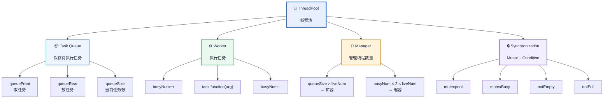

---

# 17. 当前代码的学习提示

当前版本已经能够体现线程池的核心思想：

```text
任务队列
   +
Worker
   +
Manager
   +
Mutex
   +
Condition Variable
   =
一个基本的动态线程池
```

当前代码中 `threadPoolDestroy()` 与 Worker 动态缩容后的线程 ID 管理还存在生命周期方面的改进空间。

这里暂时不影响理解线程池的核心机制。学习阶段可以先重点掌握：

1. 环形任务队列
2. `pthread_mutex_lock/unlock`
3. `pthread_cond_wait`
4. `pthread_cond_signal/broadcast`
5. Worker 获取并执行任务
6. Manager 动态扩容
7. Manager 动态缩容
8. `shutdown` 控制线程退出
9. `pthread_join` 的作用

---

## 18. 一句话总结

> **线程池本质上就是：生产者把任务放进任务队列，Worker 从队列中取任务执行，而 Manager 根据任务量和线程负载动态调整 Worker 数量。**
