# ThreadPool 学习笔记

> 本文以原有笔记中的知识点为主线，对概念进行整理、归纳和补充。图示统一使用 Mermaid，避免纯文本框图在不同环境下出现错位。

---

## 📚 目录

- [一、并发与并行](#一并发与并行)
- [二、I/O 密集型与 CPU 密集型](#二io-密集型与-cpu-密集型)
- [三、线程数量](#三线程数量)
  - [3.1 为什么不能无限创建线程](#31-为什么不能无限创建线程)
  - [3.2 线程栈](#32-线程栈)
- [四、线程池](#四线程池)
  - [4.1 线程池的核心思想](#41-线程池的核心思想)
  - [4.2 Fixed 模式](#42-fixed-模式)
  - [4.3 Cached 模式](#43-cached-模式)
- [五、线程同步](#五线程同步)
  - [5.1 线程互斥](#51-线程互斥)
  - [5.2 竞态条件](#52-竞态条件)
  - [5.3 可重入函数](#53-可重入函数)
  - [5.4 不可重入函数](#54-不可重入函数)
  - [5.5 CAS](#55-cas)
- [六、线程通信](#六线程通信)
  - [6.1 条件变量 condition_variable](#61-条件变量-condition_variable)
  - [6.2 生产者-消费者模型](#62-生产者-消费者模型)
  - [6.3 信号量 semaphore](#63-信号量-semaphore)

---

# 一、并发与并行

## 1.1 并发（Concurrency）

**并发**指多个任务在同一个时间段内都在推进。

在单核 CPU 上，多个任务并不能真正同时执行，而是由 CPU 在不同任务之间快速切换：


从宏观上看，多个任务似乎是“同时进行”的；从微观上看，同一时刻通常只有一个任务占用单核 CPU。

---

## 1.2 并行（Parallelism）

**并行**指多个任务在同一个物理时刻真正同时执行。

这通常需要多核 CPU 或多个处理器：

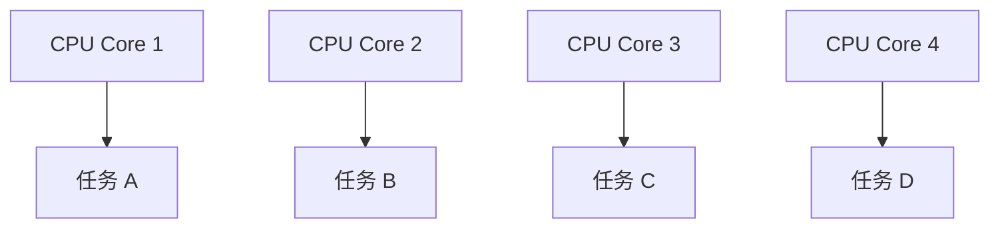

多个任务可以分别运行在不同 CPU 核心上，因此能够实现真正的同时执行。


### 并发的核心：任务之间存在交替推进

并发并不要求多个任务在同一时刻运行，而是强调**多个任务都处于可推进的状态，并由系统进行调度**。

例如单核 CPU：


因此：

> **并发关注的是“组织和调度多个任务”。**

### 并行的核心：多个执行单元同时工作

并行依赖实际的硬件执行能力，例如多核 CPU 可以让不同线程在不同核心上同时运行。

> **并行关注的是“多个任务能否在同一时刻真正执行”。**


---

## 1.3 并发 vs 并行

| 比较维度 | 并发 Concurrency | 并行 Parallelism |
|---|---|---|
| 核心含义 | 多个任务在同一时间段内推进 | 多个任务在同一物理时刻执行 |
| 单核 CPU | 可以实现 | 无法实现真正的硬件并行 |
| 多核 CPU | 可以实现 | 可以实现 |
| 典型机制 | 时间片切换、线程调度 | 多核心同时执行 |
| 关注重点 | 如何同时管理多个任务 | 如何同时执行多个任务 |

> **一句话理解：**
>
> **并发解决的是“多个任务一起推进”的问题；并行解决的是“多个任务同时执行”的问题。**

---

# 二、I/O 密集型与 CPU 密集型

理解线程池之前，需要先判断任务主要消耗的是 **CPU** 还是 **I/O**。

---

## 2.1 I/O 密集型

I/O 密集型任务的主要耗时来自输入输出操作，例如：

- 磁盘读写
- 网络通信
- 数据库查询
- 文件传输
- Web 请求

其典型特点是：

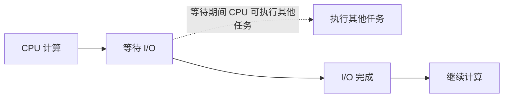

CPU 并不是一直在计算，大量时间可能消耗在等待 I/O 完成。

### 单核 CPU

当线程 A 因为 I/O 阻塞时：

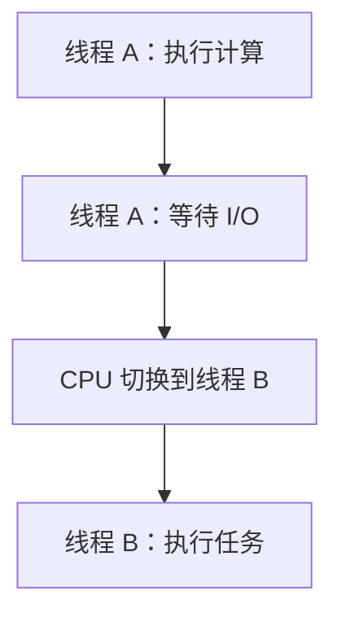

因此，多线程能够让 CPU 在一个线程等待 I/O 时执行其他任务，提高 CPU 利用率。

### 多核 CPU

多核环境下可以同时处理更多处于运行状态的任务，但 I/O 密集型程序的主要瓶颈通常仍可能来自：

- 磁盘速度
- 网络延迟
- 数据库响应速度
- 外部服务响应速度

因此，线程数通常可以高于 CPU 核心数，但具体数量需要结合实际任务、I/O 等待时间和系统资源进行调整。

---

## 2.2 CPU 密集型

CPU 密集型任务主要消耗 CPU 计算资源，例如：

- 大量数学计算
- 图像处理
- 视频编解码
- 复杂算法计算
- 游戏物理计算

典型特点：

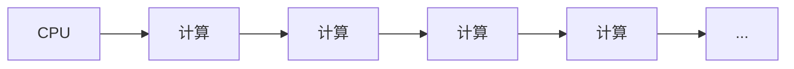

CPU 长时间处于计算状态，I/O 等待较少。

### 单核 CPU

多个线程只能通过时间片进行切换：

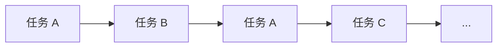

如果线程数量过多，频繁的上下文切换会增加额外开销。

因此，对于 CPU 密集型任务，线程数量通常不需要远超 CPU 核心数量。

### 多核 CPU

多核 CPU 可以让多个计算任务真正并行：

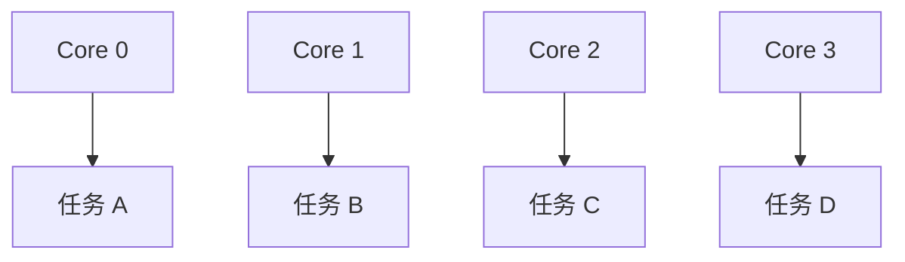

这样可以充分利用多个 CPU 核心。

> **注意：**
>
> “线程数 = CPU 核心数”是一个常见的起点，而不是绝对规则。实际线程数还需要考虑任务特征、CPU 架构、调度开销等因素。

---

## 2.3 I/O 密集型 vs CPU 密集型

| 类型 | 主要等待什么 | CPU 利用率 | 线程数量倾向 |
|---|---|---:|---|
| I/O 密集型 | 磁盘、网络、数据库等 I/O | 通常较低/波动较大 | 可以适当多一些 |
| CPU 密集型 | CPU 计算 | 通常较高 | 通常接近 CPU 核心数 |

---

# 三、线程数量

线程数量并不是越多越好。

线程数量过多可能带来：

1. 线程创建和销毁的开销；
2. 每个线程的线程栈占用内存；
3. 线程上下文切换产生额外开销；
4. 大量线程同时唤醒造成较大的调度压力，甚至出现瞬时负载过高。

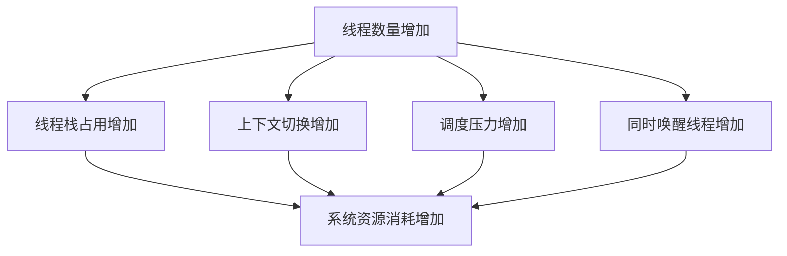

## 3.1 为什么不能无限创建线程

如果为大量任务分别创建线程：

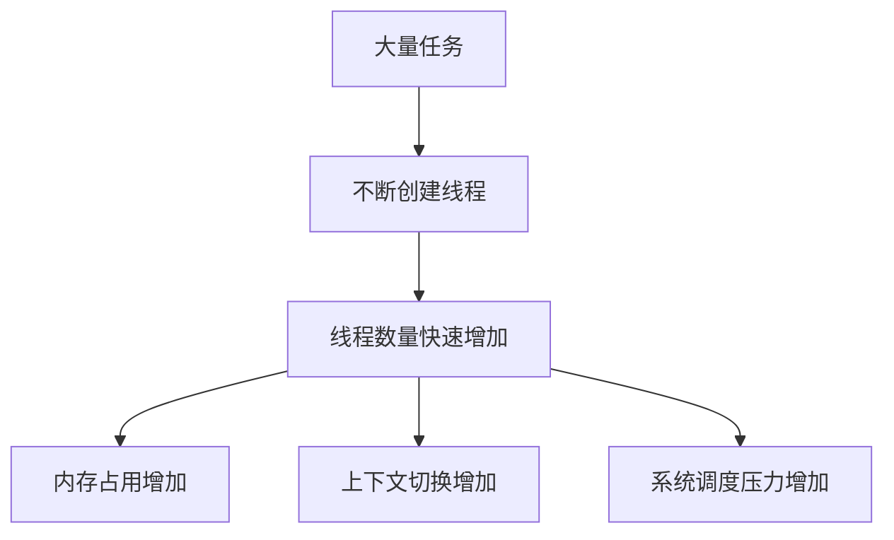

因此不能简单认为线程越多程序越快。线程数量需要结合任务类型、CPU 核心数量、I/O 等待时间以及系统资源进行考虑。

## 3.2 线程栈（Thread Stack）

**线程栈（Thread Stack）**是操作系统为每个线程单独分配的一块内存空间，用于保存线程运行过程中产生的临时数据，例如函数调用产生的栈帧、局部变量和函数参数等。

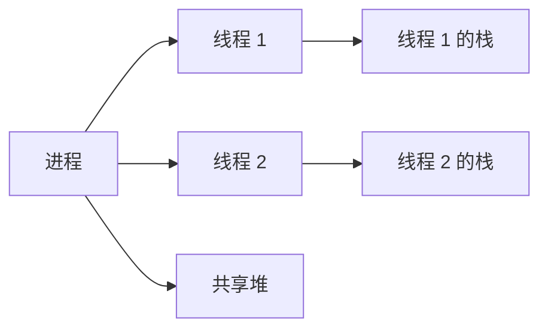

### 为什么线程使用独立的栈？

- **栈（Stack）具有线程私有特性**：每个线程拥有自己的执行路径和局部变量。
- **堆（Heap）可以被多个线程访问**：多个线程如果同时修改同一共享数据，就需要考虑线程同步。

因此可以形成一个基础认识：

> **线程栈主要保存线程自己的执行状态和局部数据；共享堆中的数据则可能成为多个线程共同访问的对象。**

### 线程栈与内存上限

每创建一个线程，就需要为它提供相应的栈空间以及其他线程相关资源。线程数量过多会使整体内存消耗不断增加，这也是限制线程数量的重要原因之一。

### 栈溢出（Stack Overflow）

如果线程发生过深的函数嵌套，或者在栈上定义了过大的局部变量，就可能耗尽线程栈空间，产生 **Stack Overflow**。

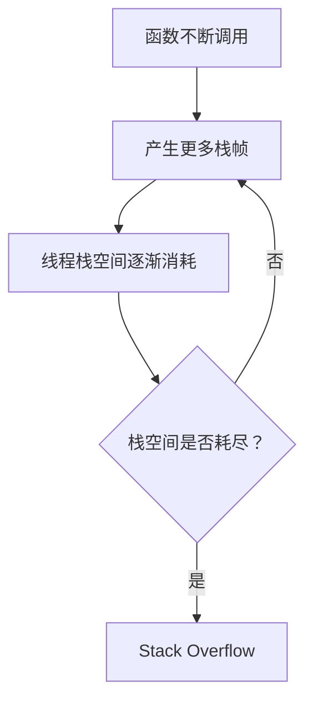


# 四、线程池

## 4.1 线程池的核心思想

线程池的核心思想是：

> **提前创建一批线程，让线程重复执行多个任务，而不是每来一个任务就创建一个新的线程。**

传统方式：

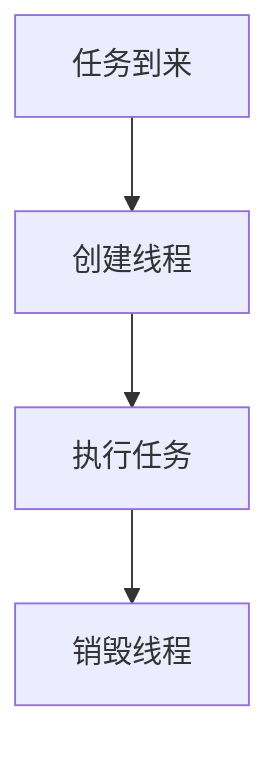

线程池方式：

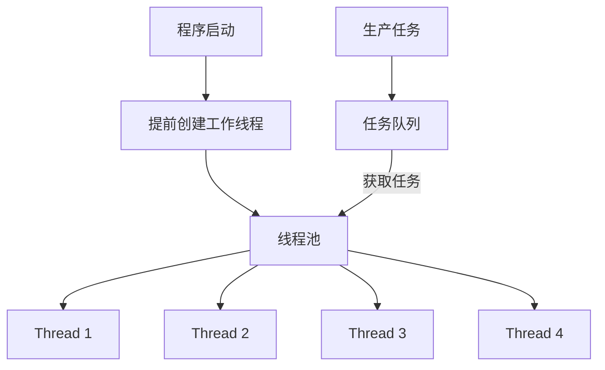

任务执行完成后，线程不会立即销毁，而是重新回到线程池中等待下一个任务。

### 线程池的主要优势

- 减少频繁创建和销毁线程的开销
- 复用线程
- 控制并发线程数量
- 提高任务处理效率
- 降低大量线程同时创建带来的系统压力

---


### 线程池的基本组成

从概念上看，一个线程池通常包含三个核心部分：

| 组成 | 作用 |
|---|---|
| 工作线程（Worker） | 真正执行任务 |
| 任务队列（Task Queue） | 暂存尚未执行的任务 |
| 同步机制 | 协调多个线程对共享状态的访问 |

基本关系：

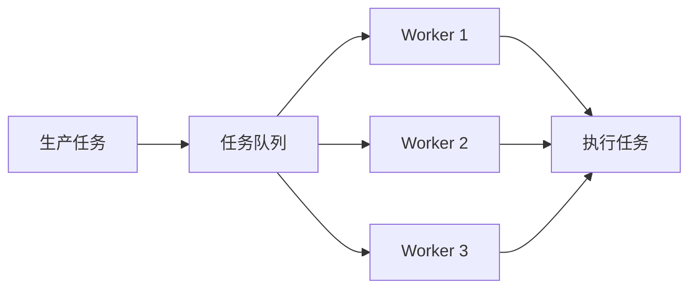

线程池最重要的思想就是：

> **任务和线程解耦。**
>
> 任务来了以后，不需要重新创建一个线程，而是将任务交给已经存在的工作线程。

## 4.2 Fixed 模式

**Fixed 模式**：线程池中的线程数量在创建后基本保持固定。

例如：

```text
线程池大小 = 4

┌──────────────────────────┐
│       Thread Pool        │
│                          │
│   T1   T2   T3   T4      │
│                          │
└──────────────────────────┘
```

任务不断进入任务队列：

```text
任务 → 任务队列 → 空闲线程 → 执行任务
```

当任务执行完成后，线程继续等待新的任务。

### 特点

- 线程数量稳定
- 资源消耗相对容易控制
- 适合负载比较稳定的场景
- 通常可以根据 CPU 核心数等因素确定初始线程数量

---

## 4.3 Cached 模式

**Cached 模式**：线程池中的线程数量可以根据任务数量动态变化。

典型思想：

```text
任务增加
   ↓
现有线程不足
   ↓
创建新的工作线程
   ↓
执行任务
```

当任务减少时：

```text
线程长时间空闲
       ↓
超过设定的空闲时间
       ↓
回收部分线程
```

因此 Cached 模式具有一定的弹性。

### 特点

- 根据任务数量动态创建线程
- 可以设置线程数量上限
- 空闲线程达到一定时间后可以回收
- 适合任务量变化较大的场景

> 原笔记中以 **60 秒**作为空闲线程回收时间的示例。实际线程池实现中，这个时间并不是固定标准，而是由具体实现决定。

---

## 4.4 Fixed 与 Cached 对比

| 特性 | Fixed | Cached |
|---|---|---|
| 线程数量 | 相对固定 | 动态变化 |
| 线程创建 | 初始化阶段创建 | 根据任务需求创建 |
| 线程回收 | 通常不频繁回收 | 空闲超时可回收 |
| 资源可控性 | 较强 | 需要设置合理上限 |
| 适用场景 | 负载较稳定 | 任务量波动较大 |

---

# 五、线程同步

当多个线程同时访问共享数据时，就会出现线程安全问题。

线程同步的核心目标可以概括为：

```text
多个线程
    ↓
访问共享资源
    ↓
可能发生竞争
    ↓
需要同步机制
    ↓
保证执行结果正确
```

线程同步通常涉及两个重要方向：

- **线程互斥**：保证同一时间只有合适的线程访问临界资源
- **线程通信**：让线程之间能够协调工作，例如等待、唤醒、传递任务

---

# 5.1 线程互斥

常见的互斥手段包括：

- `mutex` 互斥锁
- `atomic` 原子类型

### Mutex

互斥锁的基本思想：

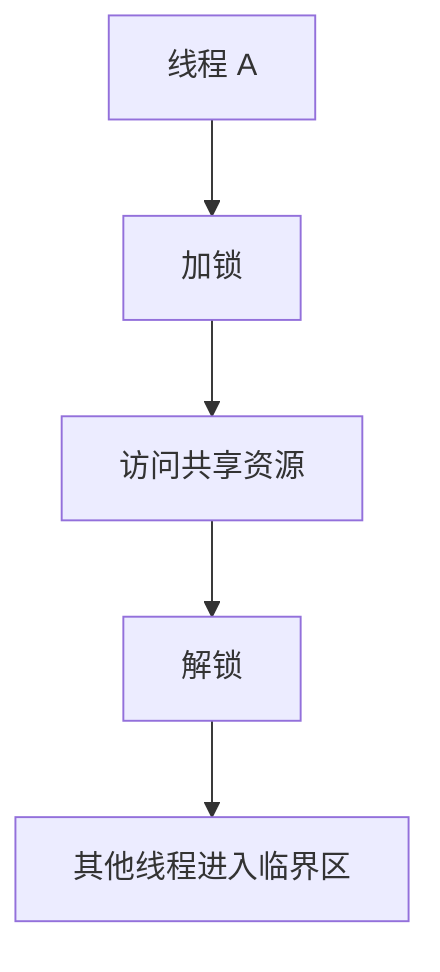

这样可以避免多个线程同时修改共享数据。

### Atomic

原子类型能够保证某些操作以**不可分割的原子操作**完成。

例如：

```cpp
std::atomic<int> counter;
```

多个线程对 `counter` 进行特定的原子操作时，可以避免普通变量在并发访问下产生的数据竞争问题。

> `atomic` 并不意味着“任何一段复杂代码自动变成线程安全”。它主要保证特定原子操作的并发安全。

---


## 5.1.1 临界区

**临界区（Critical Section）**是访问共享资源、并且需要保证访问过程具有特定同步约束的代码区域。

例如：

```cpp
lock();
shared_data++;
unlock();
```

其中对 `shared_data` 的访问就属于需要保护的区域。

可以把它理解为：


互斥锁的核心作用就是限制**同一时间进入临界区的线程数量**。

# 5.2 竞态条件

**竞态条件（Race Condition）**：

> 多个线程或进程访问共享数据时，最终结果依赖于它们执行的相对顺序。

例如：

```cpp
counter++;
```

看起来只有一条语句，但对于普通变量来说，它通常可以理解为：

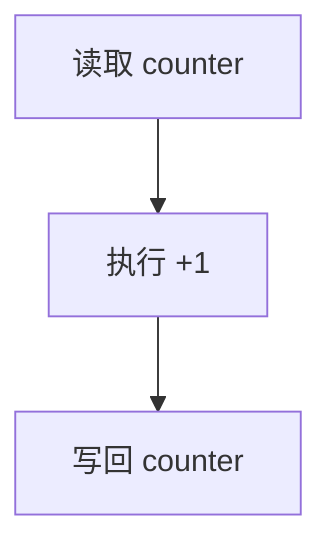

如果两个线程同时执行：

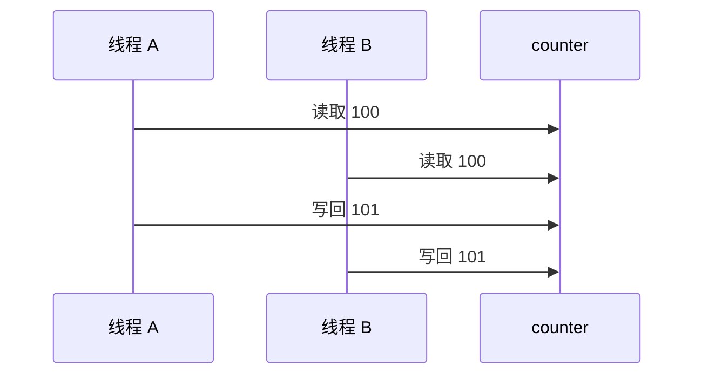

最终结果可能是：

```text
101
```

而不是期望的：

```text
102
```

这就是典型的竞态问题。

### 如何避免？

常见方法：

- 使用互斥锁保护临界区
- 使用合适的原子操作
- 使用条件变量进行线程协调
- 设计合理的数据结构和线程通信机制

---


## 5.2.1 数据竞争与竞态条件

两者经常一起出现，但概念并不完全相同：

- **竞态条件（Race Condition）**：程序结果依赖多个执行流的执行时序。
- **数据竞争（Data Race）**：多个执行流并发访问同一内存位置，至少一个访问是写操作，并且缺少必要的同步。

因此，数据竞争是一类非常典型的并发错误来源，而竞态条件的范围更广。

# 5.3 可重入函数

**可重入函数（Reentrant Function）**指一个函数在执行过程中被再次调用时，不会因为共享状态等问题导致数据破坏或逻辑错误。

可重入函数通常具有以下特点：

- 尽量不依赖共享的全局状态
- 不依赖会被并发修改的静态局部变量
- 主要使用局部变量和调用参数
- 如果必须访问共享资源，则使用适当的同步机制

例如：

```cpp
int add(int a, int b)
{
    int result = a + b;
    return result;
}
```

`result` 是局部变量，每个线程拥有自己的栈空间，因此这种函数天然更容易实现可重入。

> **重要：**
>
> “可重入”与“线程安全”相关，但不是完全等价的概念。可重入强调函数在执行过程中被再次进入时仍然能够正确工作。

---


### 可重入性的关键

判断一个函数是否容易实现可重入，可以重点观察：

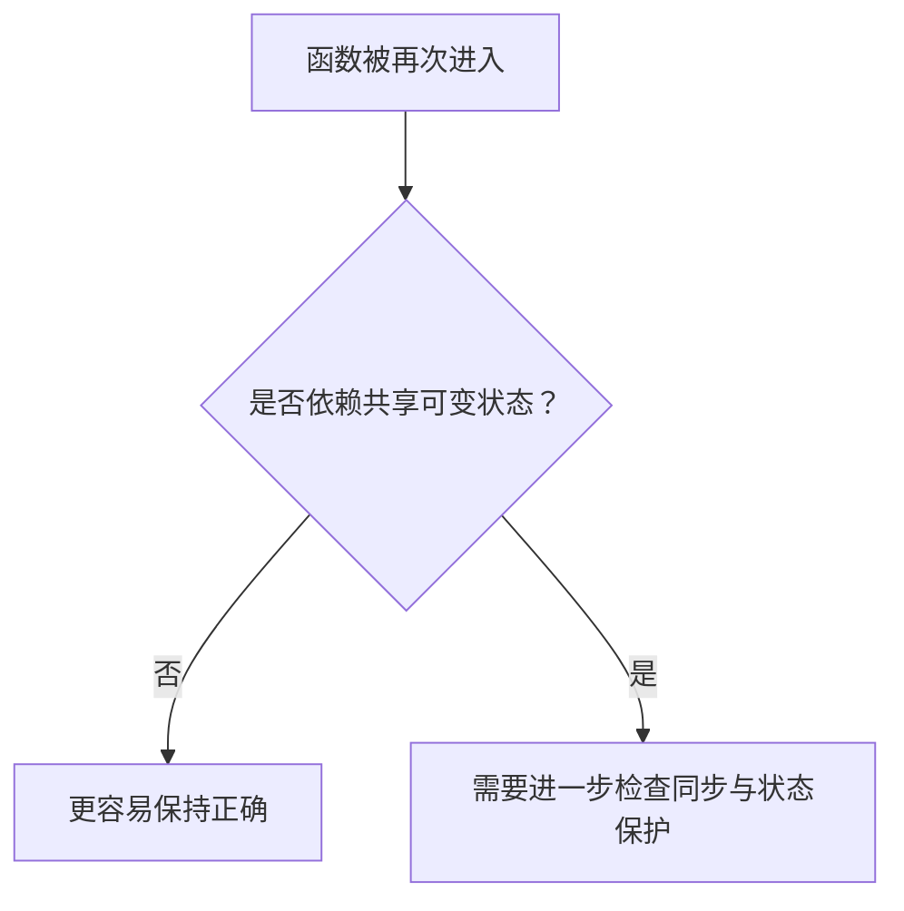

因此，“只使用局部变量”通常更容易实现可重入；而全局变量、静态可变状态以及共享缓冲区都需要特别注意。

# 5.4 不可重入函数

如果一个函数依赖共享状态，并且再次进入时可能破坏原来的执行状态，那么它可能是**不可重入函数（Non-reentrant Function）**。

常见风险来源：

- 使用可变的全局变量
- 使用未保护的静态变量
- 返回指向共享静态存储区的数据
- 调用本身存在并发安全问题的其他函数

例如：

```cpp
int get_value()
{
    static int value = 0;
    return ++value;
}
```

这里存在共享的静态变量 `value`。如果多个执行流同时进入，是否安全取决于访问方式以及是否进行了同步保护。

---

# 5.5 CAS

## 5.5.1 什么是 CAS？

**CAS（Compare-And-Swap，比较并交换）**是一种重要的原子操作，也是很多无锁数据结构和并发算法的基础。

它通常包含三个概念：

```text
V：内存地址 / 当前值所在的位置
A：Expected，期望值
B：New，新值
```

基本逻辑：

```text
如果 V == A
    ↓
将 V 修改为 B
否则
    ↓
不修改
```

整个比较和更新过程必须以原子方式完成。

---

#
## 5.5.1.1 CAS 的伪代码

可以把 CAS 抽象成：

```cpp
if (*address == expected) {
    *address = desired;
    return true;
}
return false;
```

真正的 CAS 必须保证“比较”和“交换”之间不会被其他线程插入修改，因此它不是普通的 `if + assignment`。

# 5.5.2 CAS 工作过程

假设：

```text
当前值：10
期望值：10
新值：  20
```

执行：

```mermaid
flowchart TD
    A["当前值 V"] --> B{"V == Expected？"}
    B -->|"是"| C["原子更新为 New"]
    B -->|"否"| D["更新失败，保持原值"]
```

如果比较失败，程序可以重新读取最新值，然后再次尝试。

---

## 5.5.3 CAS 的优点

### 1. 避免传统锁的阻塞

在某些适合的场景中，可以使用 CAS 构建无锁算法，从而减少线程阻塞和唤醒带来的开销。

### 2. 原子性

现代 CPU 提供相应的原子指令，例如 x86 平台中的 `CMPXCHG`，可以实现底层的比较并交换操作。

---

## 5.5.4 CAS 的问题

### ABA 问题

假设线程 A 读取：

```text
A
```

线程 B 将：

```text
A → B → A
```

线程 A 再进行 CAS 时发现当前值还是 `A`，于是认为值没有发生变化。

实际上：

```text
A → B → A
```

已经发生过变化。

常见解决思路是引入：

- 版本号
- 标记位
- 时间戳等额外信息

使得：

```mermaid
flowchart TD
    A["A<br/>version 1"] --> B["B<br/>version 2"] --> C["A<br/>version 3"]
```

即使最终值相同，版本也不同。

---

### CAS 在高竞争下可能产生较大的 CPU 开销

如果大量线程同时竞争同一个变量：

```mermaid
flowchart LR
    A["线程 A"] --> C["CAS 竞争"]
    B["线程 B"] --> C
    D["线程 C"] --> C
    E["线程 D"] --> C
    C --> F["失败"]
    F --> G["重试"]
    G --> C
```

大量失败重试会持续消耗 CPU。

因此：

> CAS 并不是“比锁更快”的绝对方案，而是需要根据竞争程度和具体场景选择。

---

### CAS 通常针对一个原子状态

单个 CAS 很适合修改一个原子变量。

如果需要同时维护多个变量的一致性：

```mermaid
flowchart LR
    A["变量 A"] --- B["变量 B"] --- C["变量 C"]
    D["需要保持多个变量的一致性"] --> A
```

就需要更复杂的无锁算法，或者直接使用互斥锁等同步机制。

---


---

# 六、线程通信

线程同步不仅包括“互斥访问”，还包括**线程之间如何等待、唤醒以及协调工作**。

```mermaid
flowchart TD
    A["线程同步"] --> B["线程互斥"]
    A --> C["线程通信"]
    B --> D["mutex / atomic / CAS"]
    C --> E["condition_variable"]
    C --> F["semaphore"]
```

## 6.1 条件变量 condition_variable

条件变量通常与互斥锁配合使用：

```text
mutex + condition_variable
```

它主要用于解决：**线程暂时没有条件继续执行时进入等待；条件满足后再被通知继续执行。**

例如消费者发现任务队列为空：

```mermaid
flowchart TD
    A["消费者线程"] --> B["获取 mutex"]
    B --> C{"任务队列为空？"}
    C -->|"是"| D["condition_variable::wait"]
    D --> E["释放 mutex 并阻塞"]
    E --> F["收到通知"]
    F --> G["重新获得 mutex"]
    G --> H["再次检查条件"]
    H --> I["获取任务"]
```

`wait()` 的关键过程可以理解为：

1. 线程在等待条件；
2. 等待期间释放 `mutex`，让其他线程能够进入临界区修改共享状态；
3. 线程被通知后重新竞争并获得 `mutex`；
4. 获得锁后再次检查条件。

因此，条件变量通常配合 `while` 检查条件：

```cpp
std::unique_lock<std::mutex> lock(mtx);

while (empty()) {
    cond.wait(lock);
}
```

---

## 6.2 生产者-消费者模型

生产者-消费者模型是多线程程序中典型的线程通信模型。

| 角色 | 作用 |
|---|---|
| 生产者 | 产生任务或商品 |
| 任务队列 | 保存尚未处理的数据 |
| 消费者 | 获取并处理任务或商品 |

```mermaid
flowchart LR
    P["生产者 Thread 1"] --> Q["任务 / 商品队列"]
    Q --> C["消费者 Thread 2"]
```

### 生产者

当队列已经达到容量上限时，生产者需要等待：

```cpp
while (full()) {
    cond.wait(lock);
}
```

生产数据后可以通知等待线程：

```cpp
cond.notify_all();
```

### 消费者

当队列为空时，消费者等待：

```cpp
while (empty()) {
    cond.wait(lock);
}
```

获取并消费数据后，也可以通知其他等待线程。

### 生产者与消费者的协调

```mermaid
sequenceDiagram
    participant P as 生产者
    participant Q as 任务队列
    participant C as 消费者

    P->>Q: 获取 mutex
    P->>Q: 检查队列是否已满
    P->>Q: 添加任务
    P-->>C: notify
    C->>Q: 获取 mutex
    C->>Q: 检查队列是否为空
    C->>Q: 获取任务
    C-->>P: notify
```

典型场景包括：

- **先生产后消费**：生产者先向队列中放入任务，消费者随后获取；
- **生产一个、消费一个**：生产者产生一个任务后，消费者立即获取并处理。

---

## 6.3 信号量 semaphore

**信号量（Semaphore）**可以理解为一种带有**资源计数**的线程同步机制。

从原笔记的理解方式来看：

> `mutex` 可以理解为资源计数只能在 `0` 和 `1` 之间变化，而 semaphore 可以维护更一般的资源数量。

例如：

```text
mutex：

1 → lock() → 0
0 → unlock() → 1
```

信号量则可以表示多个资源：

```text
0 → 1 → 2 → 3 → ...
```

例如：

```cpp
std::counting_semaphore sem(0);
```

生产者产生一个资源：

```cpp
sem.release();
```

消费者：

```cpp
sem.acquire();
```

如果当前没有可用资源，消费者等待；如果存在资源，则获取一个资源后继续执行。

### 生产者-消费者中的 semaphore

```mermaid
sequenceDiagram
    participant P as 生产者
    participant S as Semaphore
    participant C as 消费者

    P->>P: 生产一个商品
    P->>S: release()
    S-->>C: 资源计数增加
    C->>S: acquire()
    S-->>C: 获取一个资源
    C->>C: 消费商品
```

### Mutex 与 Semaphore 对比

| 特性 | Mutex | Semaphore |
|---|---|---|
| 核心思想 | 互斥访问 | 资源计数 |
| 典型计数 | `0 / 1` | 可以表示多个资源 |
| 主要用途 | 保护临界区 | 控制资源数量、线程协调 |
| 常见操作 | `lock()` / `unlock()` | `acquire()` / `release()` |
| 典型场景 | 保护共享数据 | 生产者-消费者、资源数量控制 |

---

## 6.4 线程同步知识关系

```mermaid
flowchart TD
    A["线程同步"] --> B["线程互斥"]
    A --> C["线程通信"]

    B --> D["Mutex"]
    B --> E["Atomic"]
    B --> F["CAS"]

    D --> G["临界区"]
    G --> H["保护共享资源"]

    E --> I["原子操作"]
    F --> J["无锁并发控制"]

    C --> K["condition_variable"]
    C --> L["semaphore"]

    K --> M["等待 / 唤醒"]
    K --> N["生产者-消费者"]
    L --> O["资源计数"]
    L --> N
```
